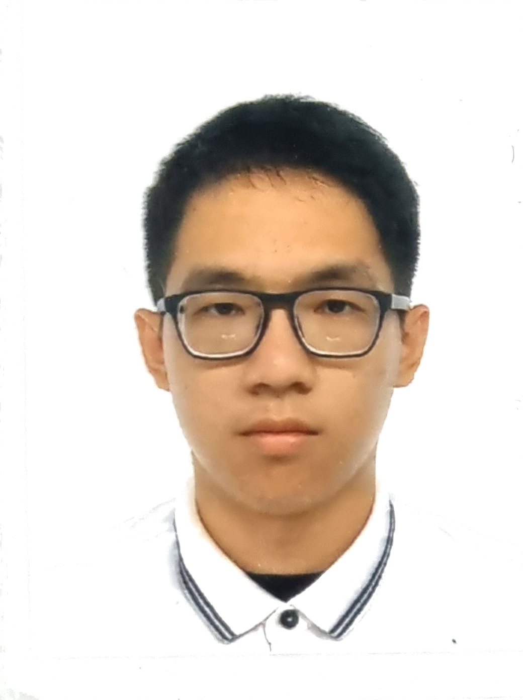
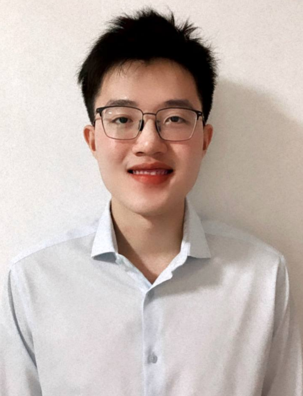
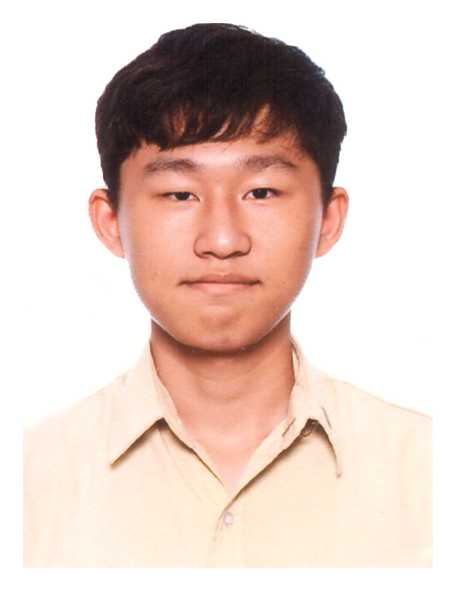

We are a team based in the [School of Computing, National University of Singapore](http://www.comp.nus.edu.sg).

You can reach us at the email `seer[at]comp.nus.edu.sg`

## Project team

### Lim Wei Chang

[[github](http://github.com/weichang18)]
[[portfolio](team/weichang18.md)]

* Role: Team Lead
* Responsibilities: Integration

### Clifford Kaleb Toh Jing Zhe

[[github](http://github.com/droffilc13)]
[[portfolio](team/droffilc13.md)]

* Role: Developer
* Responsibilities: Scheduling and tracking

### QIN GUORUI

[[github](http://github.com/qinguorui2001)]
[[portfolio](team/qinguorui2001.md)]

* Role: Code quality reviewer
* Responsibilities: Looks after code quality, ensures adherence to coding standards, etc.

### Yeo Yiheng

[[github](http://github.com/yeo-yiheng)]
[[portfolio](team/yeo-yiheng.md)]

* Role: Developer and Documentation
* Responsibilities: Ensures proper code documentation and  adherence to the documentation standards.

### Zheng Tao Jun

[[github](http://github.com/TaoJun99)]
[[portfolio](team/taojun99.md)]

* Role: Developer
* Responsibilities: Testing
