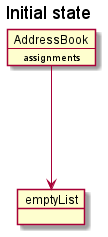
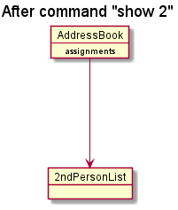
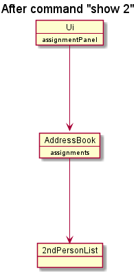
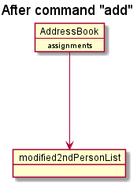
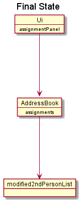
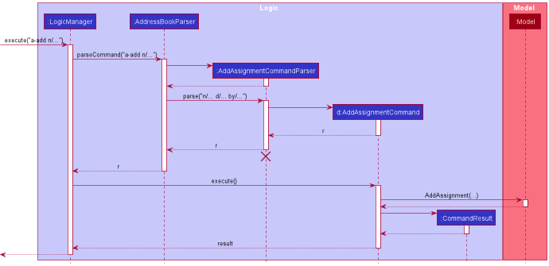

* Table of Contents
{:toc}

--------------------------------------------------------------------------------------------------------------------

## **Acknowledgements**

* TA2 is adapted from [AddressBook-Level3 (AB3)](https://github.com/nus-cs2103-AY2122S1/tp)
* For the detailed documentation of  AddressBook-Level3 project, see the **[Address Book Product Website](https://se-education.org/addressbook-level3)**.
* Libraries used: [JavaFX](https://openjfx.io/), [Jackson](https://github.com/FasterXML/jackson), [JUnit5](https://github.com/junit-team/junit5)
* {list here sources of all reused/adapted ideas, code, documentation, and third-party libraries -- include links to the original source as well}

--------------------------------------------------------------------------------------------------------------------

## **Setting up, getting started**

Refer to the guide [_Setting up and getting started_](SettingUp.md).

--------------------------------------------------------------------------------------------------------------------

## **Design**

:bulb: **Tip:** The `.puml` files used to create diagrams in this document can be found in the [diagrams](https://github.com/se-edu/addressbook-level3/tree/master/docs/diagrams/) folder. Refer to the [_PlantUML Tutorial_ at se-edu/guides](https://se-education.org/guides/tutorials/plantUml.html) to learn how to create and edit diagrams.

### Architecture

The ***Architecture Diagram*** given above explains the high-level design of the App.

Given below is a quick overview of main components and how they interact with each other.

**Main components of the architecture**

**`Main`** has two classes called [`Main`](https://github.com/se-edu/addressbook-level3/tree/master/src/main/java/seedu/address/Main.java) and [`MainApp`](https://github.com/se-edu/addressbook-level3/tree/master/src/main/java/seedu/address/MainApp.java). It is responsible for,
* At app launch: Initializes the components in the correct sequence, and connects them up with each other.
* At shut down: Shuts down the components and invokes cleanup methods where necessary.

[**`Commons`**](#common-classes) represents a collection of classes used by multiple other components.

The rest of the App consists of four components.

* [**`UI`**](#ui-component): The UI of the App.
* [**`Logic`**](#logic-component): The command executor.
* [**`Model`**](#model-component): Holds the data of the App in memory.
* [**`Storage`**](#storage-component): Reads data from, and writes data to, the hard disk.

**How the architecture components interact with each other**

The *Sequence Diagram* below shows how the components interact with each other for the scenario where the user issues the command `delete 1`.

Each of the four main components (also shown in the diagram above),

* defines its *API* in an `interface` with the same name as the Component.
* implements its functionality using a concrete `{Component Name}Manager` class (which follows the corresponding API `interface` mentioned in the previous point.

For example, the `Logic` component defines its API in the `Logic.java` interface and implements its functionality using the `LogicManager.java` class which follows the `Logic` interface. Other components interact with a given component through its interface rather than the concrete class (reason: to prevent outside component's being coupled to the implementation of a component), as illustrated in the (partial) class diagram below.

The sections below give more details of each component.

### UI component

The **API** of this component is specified in [`Ui.java`](https://github.com/se-edu/addressbook-level3/tree/master/src/main/java/seedu/address/ui/Ui.java)

The UI consists of a `MainWindow` that is made up of parts e.g.`CommandBox`, `ResultDisplay`, `PersonListPanel`, `StatusBarFooter` etc. All these, including the `MainWindow`, inherit from the abstract `UiPart` class which captures the commonalities between classes that represent parts of the visible GUI.

The `UI` component uses the JavaFx UI framework. The layout of these UI parts are defined in matching `.fxml` files that are in the `src/main/resources/view` folder. For example, the layout of the [`MainWindow`](https://github.com/se-edu/addressbook-level3/tree/master/src/main/java/seedu/address/ui/MainWindow.java) is specified in [`MainWindow.fxml`](https://github.com/se-edu/addressbook-level3/tree/master/src/main/resources/view/MainWindow.fxml)

The `UI` component,

* executes user commands using the `Logic` component.
* listens for changes to `Model` data so that the UI can be updated with the modified data.
* keeps a reference to the `Logic` component, because the `UI` relies on the `Logic` to execute commands.
* depends on some classes in the `Model` component, as it displays `Person` object residing in the `Model`.

### Logic component

**API** : [`Logic.java`](https://github.com/se-edu/addressbook-level3/tree/master/src/main/java/seedu/address/logic/Logic.java)

Here's a (partial) class diagram of the `Logic` component:

How the `Logic` component works:
1. When `Logic` is called upon to execute a command, it uses the `AddressBookParser` class to parse the user command.
1. This results in a `Command` object (more precisely, an object of one of its subclasses e.g., `AddCommand`) which is executed by the `LogicManager`.
1. The command can communicate with the `Model` when it is executed (e.g. to add a person).
1. The result of the command execution is encapsulated as a `CommandResult` object which is returned back from `Logic`.

The Sequence Diagram below illustrates the interactions within the `Logic` component for the `execute("delete 1")` API call.

:information_source: **Note:** The lifeline for `DeleteCommandParser` should end at the destroy marker (X) but due to a limitation of PlantUML, the lifeline reaches the end of diagram.

Here are the other classes in `Logic` (omitted from the class diagram above) that are used for parsing a user command:

How the parsing works:
* When called upon to parse a user command, the `AddressBookParser` class creates an `XYZCommandParser` (`XYZ` is a placeholder for the specific command name e.g., `AddCommandParser`) which uses the other classes shown above to parse the user command and create a `XYZCommand` object (e.g., `AddCommand`) which the `AddressBookParser` returns back as a `Command` object.
* All `XYZCommandParser` classes (e.g., `AddCommandParser`, `DeleteCommandParser`, ...) inherit from the `Parser` interface so that they can be treated similarly where possible e.g, during testing.

The cumulative list of all commands are:
1. **AddAssignmentCommand:** 
 Adds assignment to a specific user's assignment list 

2. **AddAssignmentToAllCommand:**
  Adds assignment to all user's assignment list 

3. **AddPersonCommand:**
  Adds person to the list 

4. **ClearCommand:**
  Clears everyone's completed tasks 

5. **DeleteAssignmentCommand:**
  Deletes a specific assignment from a specific person 

6. **DeletePersonCommand:**
  Deletes a specific person 

7. **EditPersonCommand:**
  Edits a specific person  

8. **ExitCommand:**
  Exits the application  

9. **FindPersonCommand:**
  Finds people who match the given input  

10. **HelpCommand:**
  Pulls up the help list  

11. **ListPersonCommand:**
  Displays the entire list of contacts  

12. **MarkAssignmentCommand:**
  Marks the specified assignment  

13. **RedoCommand:**
  Redo the previous command  

14. **ShowAssignmentCommand:**
  Shows a specific person's list  

15. **UndoCommand:**
  Undo the previous command  

### Model component
**API** : [`Model.java`](https://github.com/se-edu/addressbook-level3/tree/master/src/main/java/seedu/address/model/Model.java)

The `Model` component,

* stores the address book data i.e., all `Person` objects (which are contained in a `UniquePersonList` object).
* stores the currently 'selected' `Person` objects (e.g., results of a search query) as a separate _filtered_ list which is exposed to outsiders as an unmodifiable `ObservableList<Person>` that can be 'observed' e.g. the UI can be bound to this list so that the UI automatically updates when the data in the list change.
* stores a `UserPref` object that represents the user’s preferences. This is exposed to the outside as a `ReadOnlyUserPref` objects.
* does not depend on any of the other three components (as the `Model` represents data entities of the domain, they should make sense on their own without depending on other components)

:information_source: **Note:** An alternative (arguably, a more OOP) model is given below. It has a `Tag` list in the `AddressBook`, which `Person` references. This allows `AddressBook` to only require one `Tag` object per unique tag, instead of each `Person` needing their own `Tag` objects. 

### Storage component

**API** : [`Storage.java`](https://github.com/se-edu/addressbook-level3/tree/master/src/main/java/seedu/address/storage/Storage.java)

The `Storage` component,
* can save both address book data and user preference data in json format, and read them back into corresponding objects.
* inherits from both `AddressBookStorage` and `UserPrefStorage`, which means it can be treated as either one (if only the functionality of only one is needed).
* depends on some classes in the `Model` component (because the `Storage` component's job is to save/retrieve objects that belong to the `Model`)

### Common classes

Classes used by multiple components are in the `seedu.addressbook.commons` package.

--------------------------------------------------------------------------------------------------------------------

## **Implementation**

This section describes some noteworthy details on how certain features are implemented.

### Show assignment list feature

#### Implementation

The show assignment mechanism is facilitated by `AddressBook`, where the specified person's assignment list is stored internally under `assignments` This `assignments` is retrieved or updated by the following methods:
* `AddressBook#getAssignmentList()`
* `AddressBook#updateAssignmentList(Person person)`  —  where `person` is the specified person.

These methods are exposed in the `Model` interface as `Model#getFilteredAssignmentList()` and `Model#updateFilteredAssignmentList(Person person)` respectively.

Given below is an example usage scenario and how the show assignment mechanism behaves at each step.

Step 1. The user launches the application for the first time. The `assignments` will be initialized with an empty list.

Step 2. The user inputs `show 2` command to display the 2nd person's assignment list in the address book. The `show` command will then call `Model#updateFilterdAssignmentList(person)`, whereby `person` variable is the 2nd person in the address book.
This causes the `assignments` in `AddressBook` to be replaced with the 2nd person's assignment list.

Step 3. When `assignments` is updated, it is retrieved by the `Logic` using `Model#getFilteredAssignmentList()` to input into the assignment panel of the `Ui`
This results in the assignment list panel to display the assignments of the person.

Step 4. The user decides to modify the assignment list of the person by using either `give`, `done` or `remove` command. This will result in the assignment list in the person to be modified.
The command will the call `Model#updateFilteredAssignmentList(person)` to get the recent updated assignment list to replace `assignments`.

Step 5. Step 3 is repeated to show the recent updated assignment list.

#### Design considerations:
The assignment list of the specified person is stored in `AddressBook` rather than `ModelManger`

### Assignment Feature

#### Current Implementation
The `Assignment` class encapsulates the current Assignment feature and composes of `Description`, `Status` and `DueDate` class.

It implements the operation `Assignment#isSameAssignment(Assignment assignment)` to check for duplicate assignments. Currently, assignments are similar if they have the same description and this check is case-insensitive. This is because each student is under one module and having a similarly named assignment within the same module is less likely.

Next, the current available `Status` of `Assignment` are `PENDING` and `COMPLETED`. Since the type of `Status` are fixed, the `Status` class contains an `enumeration StatusType` to store the valid values. The use of static methods `Status#createCompletedStatus()` and `Status#createPendingStatus()` initialises the `COMPLETED Status` and `PENDING Status` respectively. Meanwhile, the constructor, `Status(StatusType value)`, is set to private to prevent instantiation through inheritance. 

#### Related Implementation: UniqueAssignmentList
A `UniqueAssignmentList` stores a list of `Assignment` and prevents duplicates. `Assignment` class extends `Comparable` interface for sorting purposes within a `UniqueAssignmentList`. Currently, only `AddressBook` and `Person` has a reference to `UniqueAssignmentList`.

`UniqueAssignmentList#sort()` is a method responsible for sorting the list based on the `Status` and `DueDate` of the `Assignment`. The `UniqueAssignmentList` gives more importance to assignments that are pending than completed, and if both are pending, it will break the tie by choosing the assignment with an earlier due date.

#### Design considerations:

**Aspect: How Status can be instantiated:**

* **Alternative 1 (current choice):** Instantiate Status using static methods with enumerations to store the fixed values
    * Pros: Easy to implement.
    * Cons: May become harder to update if there are more types of status with different types of behaviour

* **Alternative 2:** Use a factory method to instantiate the different types of status
    * Pros: Divides cleanly all the different types of status and intended behaviour and make it very easy to add new status with few adjustments by creating another subclass.
    * Cons: The code length is very long due to all the subclasses of status and may not be optimal for Status class with very few status types.

### \[Proposed\] Undo/redo feature

#### Proposed Implementation

The proposed undo/redo mechanism is facilitated by `VersionedAddressBook`. It extends `AddressBook` with an undo/redo history, stored internally as an `addressBookStateList` and `currentStatePointer`. Additionally, it implements the following operations:

* `VersionedAddressBook#commit()` — Saves the current address book state in its history.
* `VersionedAddressBook#undo()` — Restores the previous address book state from its history.
* `VersionedAddressBook#redo()` — Restores a previously undone address book state from its history.

These operations are exposed in the `Model` interface as `Model#commitAddressBook()`, `Model#undoAddressBook()` and `Model#redoAddressBook()` respectively.

Given below is an example usage scenario and how the undo/redo mechanism behaves at each step.

Step 1. The user launches the application for the first time. The `VersionedAddressBook` will be initialized with the initial address book state, and the `currentStatePointer` pointing to that single address book state.

Step 2. The user executes `delete 5` command to delete the 5th person in the address book. The `delete` command calls `Model#commitAddressBook()`, causing the modified state of the address book after the `delete 5` command executes to be saved in the `addressBookStateList`, and the `currentStatePointer` is shifted to the newly inserted address book state.

Step 3. The user executes `add n/David …​` to add a new person. The `add` command also calls `Model#commitAddressBook()`, causing another modified address book state to be saved into the `addressBookStateList`.

:information_source: **Note:** If a command fails its execution, it will not call `Model#commitAddressBook()`, so the address book state will not be saved into the `addressBookStateList`.

Step 4. The user now decides that adding the person was a mistake, and decides to undo that action by executing the `undo` command. The `undo` command will call `Model#undoAddressBook()`, which will shift the `currentStatePointer` once to the left, pointing it to the previous address book state, and restores the address book to that state.

:information_source: **Note:** If the `currentStatePointer` is at index 0, pointing to the initial AddressBook state, then there are no previous AddressBook states to restore. The `undo` command uses `Model#canUndoAddressBook()` to check if this is the case. If so, it will return an error to the user rather
than attempting to perform the undo.

The following sequence diagram shows how the undo operation works:

:information_source: **Note:** The lifeline for `UndoCommand` should end at the destroy marker (X) but due to a limitation of PlantUML, the lifeline reaches the end of diagram.

The `redo` command does the opposite — it calls `Model#redoAddressBook()`, which shifts the `currentStatePointer` once to the right, pointing to the previously undone state, and restores the address book to that state.

:information_source: **Note:** If the `currentStatePointer` is at index `addressBookStateList.size() - 1`, pointing to the latest address book state, then there are no undone AddressBook states to restore. The `redo` command uses `Model#canRedoAddressBook()` to check if this is the case. If so, it will return an error to the user rather than attempting to perform the redo.

Step 5. The user then decides to execute the command `list`. Commands that do not modify the address book, such as `list`, will usually not call `Model#commitAddressBook()`, `Model#undoAddressBook()` or `Model#redoAddressBook()`. Thus, the `addressBookStateList` remains unchanged.

Step 6. The user executes `clear`, which calls `Model#commitAddressBook()`. Since the `currentStatePointer` is not pointing at the end of the `addressBookStateList`, all address book states after the `currentStatePointer` will be purged. Reason: It no longer makes sense to redo the `add n/David …​` command. This is the behavior that most modern desktop applications follow.

The following activity diagram summarizes what happens when a user executes a new command:

#### Design considerations:

**Aspect: How undo & redo executes:**

* **Alternative 1 (current choice):** Saves the entire address book.
  * Pros: Easy to implement.
  * Cons: May have performance issues in terms of memory usage.

* **Alternative 2:** Individual command knows how to undo/redo by
  itself.
  * Pros: Will use less memory (e.g. for `delete`, just save the person being deleted).
  * Cons: We must ensure that the implementation of each individual command are correct.

_{more aspects and alternatives to be added}_

### Giveall feature
The giveall command allows users to add the specified assignment to all persons in the same module which are stored in 
the model. Persons who already have the specified assignment will not have a duplicated assignment added to them. The 
command is abstracted as `AddAssignmentToAllCommand` and extends `Command`. When the user inputs the command,
`Command#execute` is called and returns a `CommandResult`.

Given below is an example usage scenario and how the `AddAssignmentToAllCommand` is executed.

Step 1. The user executes `list` command to see the current list of persons.

Step 2. The user executes `giveall m/CS2100 d/Assignment 2 by/ 03/10/2021` command to add assignments to all persons in
the specified module. When `Command#execute` is called, the `giveall m/...` command will filter out persons in the current 
displayed list with the module field `CS2100`and add the specified assignment to them if they do not have the assignment.

:information_source: **Note:** If there are no persons with the specified 
module field, it will return an error to the user. 

The following sequence diagram shows how the giveall command is executed:

:information_source: **Note:** The lifeline for `AddAssignmentToAllCommand` 
should end at the destroy marker (X) but due to a limitation of PlantUML, the lifeline reaches the end of diagram.

Step 3. The user executes `show 1` to check that the specified assignment has been added for persons in the specified
module.

The following activity diagram summarizes what happens when a user executes the giveall command:

#### Design considerations:
**Aspect: Adds assignment to persons in current displayed list or to all persons:**

* **Alternative 1:** Adds assignment of persons in current displayed list
    * Pros: If the displayed list is shorter, the addition of assignments will be faster.
    * Cons: User has to carry out `list` command first if addition of assignments is desired for all persons

* **Alternative 2 (current choice):** Add assignment to all persons in the module
    * Pros: Allows user to add assignment to all persons even when some persons are not displayed in the list
    * Cons: Might take longer to execute

* Considering the fact that the giveall command is meant for users to add assignments to all persons in the specified 
module, **alternative 2** was chosen as it meets this specification. Moreover, it will not duplicate the assignment for 
persons who already have the assignment.
**Alternative 1** requires an additional command `list` to ensure the displayed list contains all persons, which 
means it is less convenient for users as they have to do extra work. 

### Clean feature
The clean command allows users to remove the all completed assignment of all persons stored in the model.
It is abstracted as `CleanAssignmentCommand` and extends `Command`. When the user inputs the command, 
`Command#execute` is called and returns a `CommandResult`. 

Given below is an example usage scenario and how the `CleanAssignmentCommand` is executed.

Step 1. The user executes `list` command to see the current list of persons.

Step 2. The user executes `clean` command to remove all the completed assignments.
When `Command#execute` is called, the `clean` command will get the assignment list of all persons in the model and
remove all assignments with the completed status.

The following sequence diagram shows how the clean command is executed:

:information_source: **Note:** The lifeline for `CleanAssignmentCommand` 
should end at the destroy marker (X) but due to a limitation of PlantUML, the lifeline reaches the end of diagram.

Step 3. The user executes `show 1` to check that all completed assignments has been removed for the first person.

The following activity diagram summarizes what happens when a user executes the clean command:

#### Design considerations:
**Aspect: Deletes completed assignments of person with assignments currently displayed or for all persons:**

* **Alternative 1:** Deletes completed assignments of person with assignments currently displayed
    * Pros: Allows for a safer delete of assignments
    * Cons: User has to carry out `show INDEX` command for every person if deletion of assignments is desired for all persons

* **Alternative 2(current choice):** Deletes completed assignment of all persons 
    * Pros: Allows user to delete assignment of all persons without the need of additional commands
    * Cons: Undesired deletion of assignment of persons not in displayed list may occur

* Considering the fact that TA2 is designed to be efficient in managing student submissions,**alternative 2** is 
chosen. When the list of persons increase to considerable numbers, deletion of completed assignments will require the user
to input an additional command for each person. Bearing in mind that users make use of the `clean` command to remove
completed assignments that they no longer want to view, **alternative 2** does this job more efficiently. Although there
may be completed assignments that users want to keep in the list which they accidentally delete, there is the `undo` command 
which allows the user to retrieve the desired assignments easily.

### Give feature
The give command allows users to add the specified assignment to a particular person is stored in the model. 
Person who already has the specified assignment will not have a duplicated assignment added to him. The
command is abstracted as `AddAssignmentCommand` and extends `Command`. When the user inputs the command,
`Command#execute` is called and returns a `CommandResult`.

Given below is an example usage scenario and how the `AddAssignmentCommand` is executed.

Step 1. The user executes `list` command to see the current list of persons.

Step 2. The user executes `give n/Xiao m/CS2103 d/Assignment 1 by/ 03/11/2021` command to add assignment to Xiao in
the specified module. When `Command#execute` is called, the `give n/...` command will filter out persons in the current
displayed list with the module field `CS2103` and add the specified assignment to him if this person exists, and he does 
not have the assignment.

:information_source: **Note:** If there are no 
persons with the specified module field, it will return an error to the user.

The following sequence diagram shows how the removeall command is executed:

:information_source: **Note:** The lifeline for `AddAssignmentCommand` 
should end at the destroy marker (X) but due to a limitation of PlantUML, the lifeline reaches the end of diagram.
   

   
Step 3. The user executes `show 1` to check that the specified assignment has been added for persons in the specified
module.

The following activity diagram summarizes what happens when a user executes the give command:

#### Design considerations:
**Aspect: Adds an assignment to a person in current displayed list or to any other person in storage:**

* **Alternative 1:** Add an assignment to a person in current displayed list
    * Pros: If the displayed list is shorter, the addition of assignments will be faster.
    * Cons: User has to carry out `list` command first if addition of assignment is desired for that person

* **Alternative 2 (current choice):** Add an assignment to any person in the storage
    * Pros: Allows user to add assignment to a particular person even when he is not visible in the list
    * Cons: Might take longer to execute

* Considering the fact that the give command is meant for users to add assignments to any person in model, 
* **Alternative 2** was chosen as it meets this specification. Moreover, it will not duplicate the assignment for
  persons who already have the assignment.
  **Alternative 1** requires an additional command `list` to ensure the displayed list contains all persons before adding 
  assignments, which means it is less convenient for users as they have to do extra work.

### Remove feature
The remove command allows users to remove the specified assignment of a particular person in model.
It is abstracted as `DeleteAssignmentCommand` and extends `Command`. When the user inputs the command,
`Command#execute` is called and returns a `CommandResult`.

Given below is an example usage scenario and how the `DeleteAssignmentCommand` is executed.

Step 1. The user executes `list` command to see the current list of persons.

Step 2. The user executes `remove n/Xiao 1` command to remove the first assignment of a person. When `Command#execute`
is called, the `remove n/...` command will filter out persons in the storage list with the name field `Xiao`and remove 
the specified assignment if the person exists and has that assignment in assignment list.

:information_source:
**Note:** If there are no persons with the specified module field or there are no persons who have this assignment, it will return an error to the user. 

The following sequence diagram shows how the remove command is executed:

:information_source: **Note:** The lifeline for `DeleteAssignmentCommand` 
should end at the destroy marker (X) but due to a limitation of PlantUML, the lifeline reaches the end of diagram.

  
Step 3. The user executes `show 1` to check that the specified assignment has been removed for person in the specified
module with that assignment.

The following activity diagram summarizes what happens when a user executes the remove command:

#### Design considerations:
**Aspect: Deletes assignment of a person in current displayed list or for any person in storage:**

* **Alternative 1:** (current choice) Deletes assignment of a person in current displayed list
    * Pros: Allows for a safer delete of assignments
    * Cons: User has to carry out `list` command first if required person is not in the current displayed list

* **Alternative 2:** Deletes assignment of any person with that name and assignment
    * Pros: Allows user to delete assignment of a person without the need of additional commands
    * Cons: User may not be certain about which person's assignment to delete if several of them has completed assignment
    and likely to remember the wrong person name if the current person displayed list is not shown

* Considering the fact that TA2 is designed to be efficient in managing student submissions,**alternative 1** is
  chosen. The potential undesired deletion of assignments in **alternative 2** means the user has to manually recover the
  deleted assignment by adding the assignment again. Compared to the additional time taken to execute the `list` command
  in **alternative 1**, it may take up much more time.

### Done feature
The done command allows users to mark the specified assignment of a particular person in model.
It is abstracted as `MarkAssignmentCommand` and extends `Command`. When the user inputs the command,
`Command#execute` is called and returns a `CommandResult`.

Given below is an example usage scenario and how the `MarkAssignmentCommand` is executed.

Step 1. The user executes `list` command to see the current list of persons.

Step 2. The user executes `done n/Xiao 1` command to mark the first assignment of a `Xiao` as done. When `Command#execute` is called,
the `done n/...` command will filter out persons in the storage list with the name field `Xiao`and mark the specified assignment
if the person exists and has that assignment in assignment list.

:information_source: 
**Note:** If there are no persons with the specified name field or there are no persons who have this assignment, it will return an error to the user. 

   
The following sequence diagram shows how the done command is executed:

:information_source: **Note:** The lifeline for `MarkAssignmentCommand` 
should end at the destroy marker (X) but due to a limitation of PlantUML, the lifeline reaches the end of diagram.

   
Step 3. The user executes `show 1` to check that the specified assignment has been marked for person with specified
name with that assignment.

The following activity diagram summarizes what happens when a user executes the done command:

#### Design considerations:
**Aspect: Marks assignment of a person in current displayed list as done or for any person in storage model:**

* **Alternative 1:** (current choice) Marks assignment of a person in current displayed list
    * Pros: Allows for a safer mark of assignments
    * Cons: User has to carry out `list` command first if required person is not in the current displayed list

* **Alternative 2:** Marks assignment of any person with that name and assignment
    * Pros: Allows user to mark assignment of a person without the need of additional commands
    * Cons: User may not be certain about which person's assignment to mark if several of them has completed assignment
      and likely to remember the wrong person name if the current person displayed list is not shown

* Considering the fact that TA2 is designed to be user-friendly in managing student submissions,**alternative 1** is
  chosen. The potential undesired mark of assignments in **alternative 2** means the user has to manually recover the
  marked assignment by undoing and marking assignment again. Compared to the additional time taken to execute the `list` command
  in **alternative 1**, it may take up much more time.

### Find 
The *find command* allows users to find specific people in their list, based on certain
matching criteria such as:

1. Name
2. Module
3. Tags

The command is represented by the `find` keyword.

This allows users to specify their list and cut down on the amount of information displayed,
selectively choosing those that the users would only like to see. 

The *Find Command* is a subclass of the *Command* class. Once the user enters the `find`
keyword, the `LogicManager` class will execute the command and pass the
input to the `AddressBookParser` class to parse the given input. 

From this class, a specific parser class known as the `FindPersonCommandParser`
is created and used to parse the input based on the *find* specificity.

Next, the `FindPersonCommandParser` class returns a `FindPersonCommand` or
an exception, depending on the validity of the command input. The 
Command#execute is then called, returning a `CommandResult` class.

Given below is a more specific example of the command execution.

1. The user wants to find a specific person based on their name
2. The user executes `find n/alice`, causing a `FindPersonCommand` to be returned
3. The Command#execute is called, which causes the list to update and reflect those whose names matches alice

The sequence of this command execution can be visualized using the
below sequence diagram:

:information_source: **Note:** The lifeline for `FindPersonCommand`
should end at the destroy marker (X) but due to a limitation of PlantUML, the lifeline reaches the end of diagram.

   
The following activity diagram summarizes what happens when a user executes the *Find Command*:

#### Design considerations:
**Aspect: Finding people based on OR criteria or AND criteria**

* **Alternative 1 (current choice):** Allows user to find people based on **OR** criteria
  * Pros: Allows for a more flexible search, making it less error-prone
  * Cons: Reduce efficiency of searching for specific people if large chunks of information
  is returned

* **Alternative 2:** Allow users to find people based on **AND** criteria
  * Pros: Users can perform more powerful searching to suit their
  requirements and criteria, thus possibly being more effective and efficient 
  if the user knows who is in mind
  * Cons: Less error tolerant as one simple mistake can result in no matches
  being returned.

#### [Proposed] Find Extension
1. Allow finding to have both specificity and flexibility

### Friendlier Command Inputs
In striving to adopt a more user-centric approach in command recognition, additional commands are
included on top of the original commands which stuck by a strict and predefined prefix. This offered
very little flexibility to our users in an event they make a mistake.

Here are the commands that currently support a *friendly* input command:
1. `give`

The `give` command has the sole purpose of adding a single assignment to an individual in the list.
The following table contains the new *friendly* commands that a user may provide, instead of the
original command inputs.

| Friendly Command                            | Corresponding Command                         |   Example Usages                                                         |                                                
| ------------------------------------------- | --------------------------------------------- | ------------------------------------------------------------------------ |
| tmr                                         | sets the date to be tomorrow                  | give n/name d/description by/tmr                                        |
| today                                       | sets the date to be the current date          | give n/name d/description by/today                                      |                                                                        
| week                                        | sets the date to be a week from now           | give n/name d/description by/week                                       |
| mon                                         | sets the date to be the upcoming monday       | give n/name d/description by/mon                                        |
| tue                                         | sets the date to be the upcoming tuesday      | give n/name d/description by/tue                                        |                                                                         
| wed                                         | sets the date to be the upcoming wednesday    | give n/name d/description by/wed                                        |
| thu                                         | sets the date to be the upcoming thursday     | give n/name d/description by/thu                                        |
| fri                                         | sets the date to be the upcoming friday       | give n/name d/description by/fri                                        | 
| sat                                         | sets the date to be the upcoming saturday     | give n/name d/description by/sat                                        |
| sun                                         | sets the date to be the upcoming sunday       | give n/name d/description by/sun                                        |

When the user enters a *friendly* command, the `AddressBookParser` class will recognize the command
to be an add assignment command. This triggers the `AddAssignmentParser#parse` method to be called with the
user input arguments. From there, the `AddAssignmentParser` parses each individual argument
token and for the *friendly* command, it will be recognized within the `DueDate` class as a date with
a *friendly* command format. This then calls the Java `TemporalAdjusters` class to return a `LocalDate` instance
that represents the desired *friendly* command input. From here, the `AddAssignmentCommand` class is then instantiated and
results actualized by the `Model` component.

The following activity diagram shows the possible paths whilst a user adds an assignment:

The following sequence diagram shows the logic sequence of an AddAssignment command execution:

div markdown="span" class="alert alert-info">:information_source: **Note:** The lifeline for `AddAssignmentCommand`
should end at the destroy marker (X) but due to a limitation of PlantUML, the lifeline reaches the end of diagram.

#### Design considerations:
**Aspect: Rigidity in allowing users to add assignments correctly yet handle multiple short-form user inputs:**

* **Alternative 1 (current choice):** Allows users to add based on format and some *friendly* commands
    * Pros: Allows for a safer addition of assignment, ensuring strict adherence to format
    * Cons: User has to memorize the command usage or get it wrong the first time to view the error message

* **Alternative 2:** Simplify the rigid commands and make all commands user-friendly 
    * Pros: Users can perform more powerful addition of assignments without having to type too much or following too strict 
  of a guideline
    * Cons: Requires the application to recognize a lot of different words, be it short or long form, to allow
    maximum user-friendliness, which may not be too feasible to achieve
    
#### [Proposed] Friendly Commands
1. `find`

--------------------------------------------------------------------------------------------------------------------

## **Documentation, logging, testing, configuration, dev-ops**

* [Documentation guide](Documentation.md)
* [Testing guide](Testing.md)
* [Logging guide](Logging.md)
* [Configuration guide](Configuration.md)
* [DevOps guide](DevOps.md)

--------------------------------------------------------------------------------------------------------------------

## **Appendix: Requirements**

### Product scope

**Target user**

TA2 is developed for Teaching Assistants(TA) and Professors in the School of Computing(SOC) at the National 
University of Singapore(NUS).

**Profile:**
* has a need to manage student submissions
* has a need to take note of student inquiries
* has a need to organise information across modules
* (for TAs) has a need to organise own tasks and tasks as a TA
* has no time to organise information manually
* can type fast
 
**Value proposition**

TA2 aims to help SOC TAs and professors by managing student submissions in an 
efficient manner. Without the need to manually keep track of information in a separate document, they
will be able to save more time. As users who are able to type fast, they will be able to manage module
information(student submissions etc.) much faster than when using a mouse/GUI driven app.

### User stories

Priorities: High (must have) - `* * *`, Medium (nice to have) - `* *`, Low (unlikely to have) - `*`

| Priority | As a …​                                  | I want to …​                               | So that I can…​                                                       |                                                
| -------- | ------------------------------------------- | --------------------------------------------- | ------------------------------------------------------------------------ |
| `* * *`  | tutor for the first use                     | see all commands available                    | recall commands and use them properly when I forget how to use the app   |
| `* * *`  | tutor                                       | add a new student or professor                |                                                                          |
| `* * *`  | tutor                                       | delete a student or professor                 | remove entries that I no longer need                                     |
| `* * *`  | tutor                                       | find a person by name or module               | locate details of persons without having to go through the entire list   |
| `* * *`  | tutor                                       | assign tasks to students                      |                                                                          |
| `* * *`  | tutor                                       | delete tasks assigned before                  | remove the outdated assignments for students                             |
| `* * *`  | tutor                                       | mark students' tasks as done                  | record students' progress more easily                                    |
| `* * *`  | tutor teaching online                       | access the web links used for teaching        | access information from teaching websites immediately                    |
| `* * *`  | tutor for several modules                   | organize student data according to module     | manage my tasks of different modules in an organised manner              |
| `* * *`  | student and tutor                           | organise my tasks in order of deadline        | manage my time better                                                    |
| `* * *`  | easily frustrated tutor                     | search up contacts on the search bar fuss-free| save time used for fighting the app over syntax issues                   |
| `* * *`  | tutor with many persons in the contact book | sort persons by name                          | locate a person easily                                                   |
| `* * *`  | responsible tutor                           | track students' progress on their assignments | identify and reach out to those who need help                            |
| `* * *`  | tutor                                       | list all students I am teaching               | ensure I added right and correct number of people before                 |
| `* *`    | busy tutor                                  | list certain people I interacted frequently   | save time searching their name whenever I start app                      | 
| `*`      | clumsy tutor                                | undo actions                                  | recover information that I accidentally delete                           |

*{More to be added}*

### Use cases

(For all use cases below, the **System** is the `AddressBook` and the **Actor** is the `user`, unless specified otherwise)

**Use case: UC01 - Find a person**

**MSS**
1. User requests to find a person with the specified keyword(s)
2. TA2 shows a list of persons with matching keyword(s)

   Use case ends.

**Extensions**

* 1a. The format of the command is invalid.
  * 1a1. TA2 shows an error message.
  
    Use case resumes at step 1
* 2a. No persons match the specified keyword(s).

    Use case ends.

**Use case: UC02 - Delete a person**

**MSS**

1.  User requests to list persons
2.  TA2 shows a list of persons
3.  User requests to delete a specific person in the list
4.  TA2 deletes the person

    Use case ends.

**Extensions**

* 2a. The list is empty.

  Use case ends.

* 3a. The given index is invalid.

    * 3a1. TA2 shows an error message.

      Use case resumes at step 2.

**Use case: UC03 - List all person in the address book**

**MSS**

1. User requests to list persons
2. TA2 shows a list of persons

**Extensions**
* 2a. The list is empty.
  Use case ends.
  
  
**Use case: UC05 - Add a person**

**MSS**

1. User enters a new person's information
2. TA2 shows the person is added

    Use case ends.

**Extensions**

* 1a. The given command format is invalid.

    * 1a1. TA2 shows an error message related to invalid format.

      Use case resumes at step 1.
  
* 1b. The added person is already in the list.

    * 1b1. TA2 requests to add another person.

      Use case resumes at step 1.

**Use case: UC06 - Add an assignment**

**MSS**

1. User enters the assignment information
2. TA2 shows the assignment information is added

   Use case ends

**Extensions**

* 1a. The assignment information already exists in that person's assignment list.
  
    * 1a1. TA2 shows message that the assignment already exists.
  
    Use case ends.

* 1b. The given instruction format is invalid.

    * 1b1 TA2 shows an error message.
  
    Use case resumes at step 1.

**Use case: UC07 - Remove an assignment**

**MSS**

1. User requests to list assignments of a person
2. TA2 shows a list of assignments
3. User requests to delete a specific assignment in the list
4. TA2 deletes the assignment

   Use case ends

**Extensions**

* 2a. The list is empty.

  Use case ends.

* 3a. The given index is invalid.

    * 3a1. TA2 shows an error message.

      Use case resumes at step 2.

**Use case: UC08 - Mark an assignment as done**

**MSS**

1. User requests to list assignments of a person
2. User requests to mark a specific assignment in the list as done
3. TA2 shows the assignment is done

   Use case ends

**Extensions**

* 2a. The assignment doesn't exist in the assignment list.

  Use case ends.

* 2b. The given index is invalid.

    * 2b1. TA2 shows an error message.

      Use case resumes at step 1.
  
*{More to be added}*

### Non-Functional Requirements

1. Should work on any _mainstream OS_ as long as it has Java `11` or above installed.
2. Should be able to hold up to 1000 persons without a noticeable sluggishness in performance for typical usage.
3. A user with above average typing speed for regular English text (i.e. not code, not system admin commands) should be able to accomplish most of the tasks faster using commands than using the mouse.
4. System should respond within 2 seconds of user request.
5. Should be a single user product.
6. Data should be stored in a human editable text file.
7. Data cannot be stored in DBMS. 
8. Size of products should not exceed 100 MB.
9. Size of documents should not exceed 15 MB per file.

*{More to be added}*

### Glossary

* **Mainstream OS**: Windows, Linux, Unix, OS-X
* **Private contact detail**: A contact detail that is not meant to be shared with others
* **e/**: Symbol for a requirement to state email address
* **m/**: Symbol for a requirement to state the module
* **n/**: Symbol for a requirement to state a name
* **TA**: Abbreviation for the tutor
* **UC**: Abbreviation for the use case
* **SOC**: Abbreviation for the school of computing

--------------------------------------------------------------------------------------------------------------------

## **Appendix: Instructions for manual testing**

Given below are instructions to test the app manually.

:information_source: **Note:** These instructions only provide a starting point for testers to work on;
testers are expected to do more *exploratory* testing.

### Launch and shutdown

1. Initial launch

   1. Download the jar file and copy into an empty folder

   1. Double-click the jar file Expected: Shows the GUI with a set of sample contacts. The window size may not be optimum.

1. Saving window preferences

   1. Resize the window to an optimum size. Move the window to a different location. Close the window.

   1. Re-launch the app by double-clicking the jar file. 
       Expected: The most recent window size and location is retained.

1. _{ more test cases …​ }_

### Deleting a person

1. Deleting a person while all persons are being shown

   1. Prerequisites: List all persons using the `list` command. Multiple persons in the list.

   1. Test case: `delete 1` 
      Expected: First contact is deleted from the list. Details of the deleted contact shown in the status message. Timestamp in the status bar is updated.

   1. Test case: `delete 0` 
      Expected: No person is deleted. Error details shown in the status message. Status bar remains the same.

   1. Other incorrect delete commands to try: `delete`, `delete x`, `...` (where x is larger than the list size) 
      Expected: Similar to previous.

1. _{ more test cases …​ }_

### Saving data

1. Dealing with missing/corrupted data files

   1. _{explain how to simulate a missing/corrupted file, and the expected behavior}_

2. _{ more test cases …​ }_

