--------------------------------------------------------------------------------------------------------------------

## **Welcome to TA<sup>2</sup>'s Developer Guide!**
{:.no_toc}

**Teaching Assistant's Assistant (TA<sup>2</sup>)** is a desktop application designed for teaching assistants
from the School of Computing (SoC) at the National University of Singapore (NUS) to manage student information and keep track of students' assignment submissions.

If you are interested in contributing to **TA<sup>2</sup>**, this guide is designed to help you get started!
There are a variety of ways to contribute to **TA<sup>2</sup>** such as coding, testing, improving the design of the interface and updating the documentation.

*Last Updated: 8 November 2021* 

--------------------------------------------------------------------------------------------------------------------
<div style="page-break-after: always;"></div>

## **Table of Contents**
{:.no_toc}

* Table of Contents
{:toc}

--------------------------------------------------------------------------------------------------------------------
<div style="page-break-after: always;"></div>

## **Acknowledgements**

* **TA<sup>2</sup>** is adapted from [AddressBook-Level3 (AB3)](https://github.com/nus-cs2103-AY2122S1/tp)
* For the detailed documentation of  AddressBook-Level3 project, see the **[Address Book Product Website](https://se-education.org/addressbook-level3)**.
* Libraries used: [JavaFX](https://openjfx.io/), [Jackson](https://github.com/FasterXML/jackson), [JUnit5](https://github.com/junit-team/junit5), [TemporalAdjusters](https://docs.oracle.com/javase/8/docs/api/java/time/temporal/TemporalAdjusters.html)
* Code reused: 
  * [Valid date regex](https://stackoverflow.com/questions/4374185/regular-expression-match-to-test-for-a-valid-year)
  * [Delete elements after pointer](https://stackoverflow.com/questions/11530276/how-do-i-implement-a-simple-undo-redo-for-actions-in-java)
  * [Removing extra whitespaces within String](https://stackoverflow.com/questions/2932392/java-how-to-replace-2-or-more-spaces-with-single-space-in-string-and-delete-lead)

--------------------------------------------------------------------------------------------------------------------

## **Setting up, getting started**

To get started, check out this guide [_Setting up and getting started_](SettingUp.md).

--------------------------------------------------------------------------------------------------------------------
<div style="page-break-after: always;"></div>

## **Design**

<div markdown="span" class="alert alert-primary">

:bulb: **Tip:** The `.puml` files used to create diagrams in this document can be found in the [diagrams](https://github.com/AY2122S1-CS2103T-T13-2/tp/tree/master/docs/diagrams) folder. Refer to the [_PlantUML Tutorial_ at se-edu/guides](https://se-education.org/guides/tutorials/plantUml.html) to learn how to create and edit diagrams.
</div>

### Architecture

<p align="center">
  
</p>

The ***Architecture Diagram*** given above explains the high-level design of the App.

Given below is a quick overview of main components and how they interact with each other.

<div style="page-break-after: always;"></div>

**Main components of the architecture**

**`Main`** has two classes called [`Main`](https://github.com/AY2122S1-CS2103T-T13-2/tp/blob/master/src/main/java/seedu/address/Main.java) and [`MainApp`](https://github.com/AY2122S1-CS2103T-T13-2/tp/blob/master/src/main/java/seedu/address/MainApp.java). It is responsible for,
* At app launch: Initializes the components in the correct sequence, and connects them up with each other.
* At shut down: Shuts down the components and invokes cleanup methods where necessary.

[**`Commons`**](#common-classes) represents a collection of classes used by multiple other components.

The rest of the App consists of four components.

* [**`UI`**](#ui-component): The UI of the App.
* [**`Logic`**](#logic-component): The command executor.
* [**`Model`**](#model-component): Holds the data of the App in memory.
* [**`Storage`**](#storage-component): Reads data from, and writes data to, the hard disk.


**How the architecture components interact with each other**

The *Sequence Diagram* below shows how the components interact with each other for the scenario where the user issues the command `delete 1`.

<p align="center">
  
</p>

Each of the four main components (also shown in the diagram above),

* defines its *API* in an `interface` with the same name as the Component.
* implements its functionality using a concrete `{Component Name}Manager` class (which follows the corresponding API `interface` mentioned in the previous point.

<div style="page-break-after: always;"></div>

For example, the `Logic` component defines its API in the `Logic.java` interface and implements its functionality using the `LogicManager.java` class which follows the `Logic` interface. Other components interact with a given component through its interface rather than the concrete class (reason: to prevent outside component's being coupled to the implementation of a component), as illustrated in the (partial) class diagram below.

<p align="center">
  
</p>

The sections below give more details of each component.

<div style="page-break-after: always;"></div>

### UI component

The **API** of this component is specified in [`Ui.java`](https://github.com/AY2122S1-CS2103T-T13-2/tp/blob/master/src/main/java/seedu/address/ui/Ui.java)

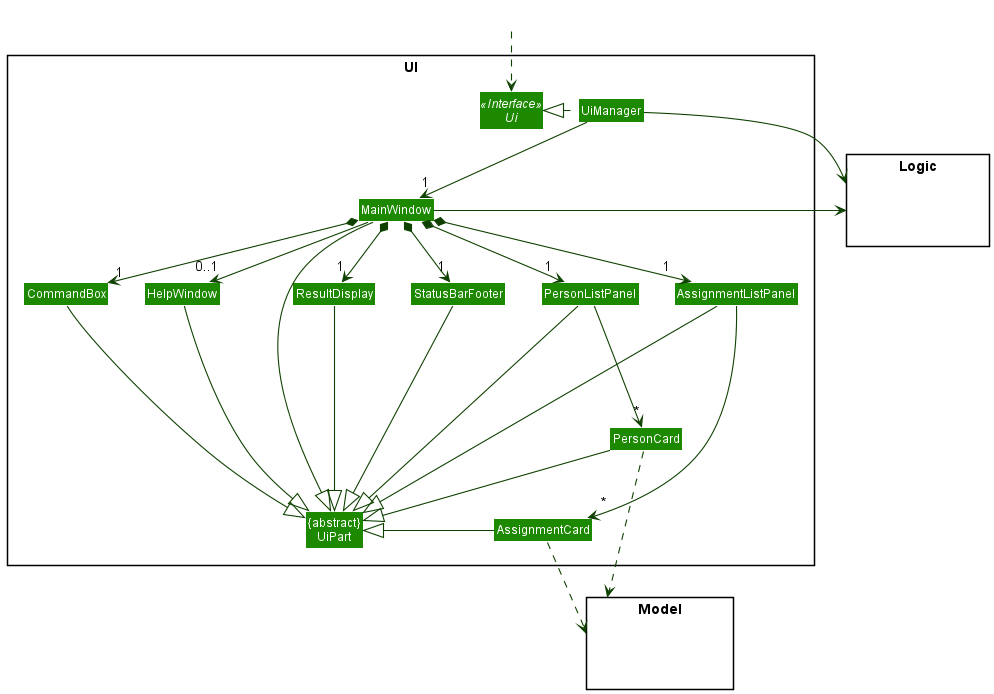

The UI consists of a `MainWindow` that is made up of parts e.g.`CommandBox`, `ResultDisplay`, `PersonListPanel`, `StatusBarFooter` etc. All these, including the `MainWindow`, inherit from the abstract `UiPart` class which captures the commonalities between classes that represent parts of the visible GUI.

The `UI` component uses the JavaFx UI framework. The layout of these UI parts are defined in matching `.fxml` files that are in the `src/main/resources/view` folder. For example, the layout of the [`MainWindow`](https://github.com/AY2122S1-CS2103T-T13-2/tp/blob/master/src/main/java/seedu/address/ui/MainWindow.java) is specified in [`MainWindow.fxml`](https://github.com/AY2122S1-CS2103T-T13-2/tp/blob/master/src/main/resources/view/MainWindow.fxml)

The `UI` component,

* executes user commands using the `Logic` component.
* listens for changes to `Model` data so that the UI can be updated with the modified data.
* keeps a reference to the `Logic` component, because the `UI` relies on the `Logic` to execute commands.
* depends on some classes in the `Model` component, as it displays `Person` and `Assignment` object residing in the `Model`.

<div style="page-break-after: always;"></div>

### Logic component

**API** : [`Logic.java`](https://github.com/AY2122S1-CS2103T-T13-2/tp/blob/master/src/main/java/seedu/address/logic/Logic.java)

Here's a (partial) class diagram of the `Logic` component:

<p align="center">
  
</p>

How the `Logic` component works:
1. When `Logic` is called upon to execute a command, it uses the `AddressBookParser` class to parse the user command.
1. This results in a `Command` object (more precisely, an object of one of its subclasses e.g., `AddCommand`) which is executed by the `LogicManager`.
1. The command can communicate with the `Model` when it is executed (e.g. to add a person).
1. The result of the command execution is encapsulated as a `CommandResult` object which is returned back from `Logic`.

<div style="page-break-after: always;"></div>

The Sequence Diagram below illustrates the interactions within the `Logic` component for the `execute("delete 1")` API call.


<div markdown="span" class="alert alert-info">:information_source: 
**Note:** The lifeline for `DeleteCommandParser` should end at the destroy marker (X) but due to a limitation of PlantUML, the lifeline reaches the end of diagram.
</div>

Here are the other classes in `Logic` (omitted from the class diagram above) that are used for parsing a user command:

<p align="center">
  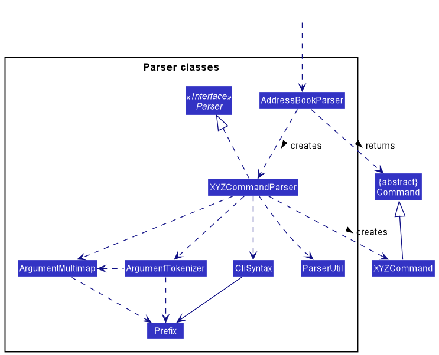
</p>

How the parsing works:
* When called upon to parse a user command, the `AddressBookParser` class creates an `XYZCommandParser` (`XYZ` is a placeholder for the specific command name e.g., `AddCommandParser`) which uses the other classes shown above to parse the user command and create a `XYZCommand` object (e.g., `AddCommand`) which the `AddressBookParser` returns back as a `Command` object.
* All `XYZCommandParser` classes (e.g., `AddCommandParser`, `DeleteCommandParser`, ...) inherit from the `Parser` interface so that they can be treated similarly where possible e.g, during testing.

<div style="page-break-after: always;"></div>

### Model component
**API** : [`Model.java`](https://github.com/AY2122S1-CS2103T-T13-2/tp/blob/master/src/main/java/seedu/address/model/Model.java)

<p align="center">
  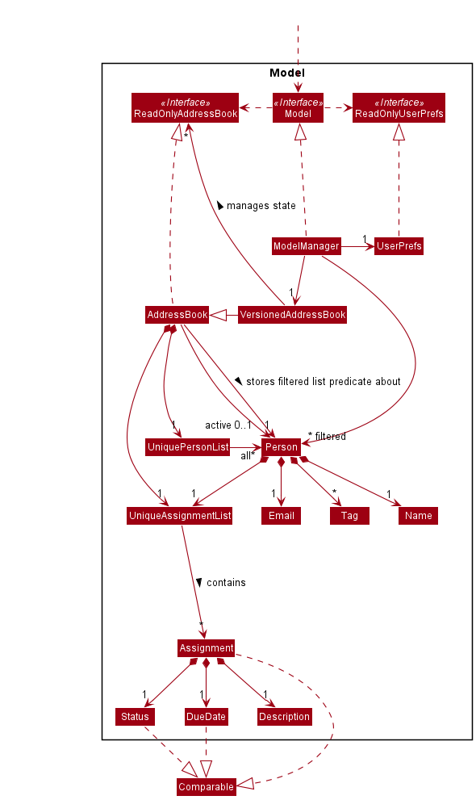
</p>

The `Model` component,

* stores the versioned address book data which includes
  * all `Person` objects contained in a `UniquePersonList` object
  * all `Assignment` objects of the "active" `Person` object contained in a `UniqueAssignmentList` object
  * the "active" `Person` (the person whose assignments are stored in `UniqueAssignmentList` of `AddressBook`)
  * the current predicate of the filtered person list
  * the states of `ReadOnlyAddressBook`
* stores the currently 'selected' `Person` objects (e.g., results of a search query) as a separate _filtered_ list which is exposed to outsiders as an unmodifiable `ObservableList<Person>` that can be 'observed' e.g. the UI can be bound to this list so that the UI automatically updates when the data in the list change.
* stores the currently 'selected' `Assignment` objects of the "active" `Person` object as a separate _observable_ list which is exposed to outsiders as an unmodifiable `ObservableList<Assignment>` that can be 'observed' as well.
* stores a `UserPref` object that represents the user’s preferences. This is exposed to the outside as a `ReadOnlyUserPref` objects.
* does not depend on any of the other three components (as the `Model` represents data entities of the domain, they should make sense on their own without depending on other components)

<div style="page-break-after: always;"></div>

### Storage component

**API** : [`Storage.java`](https://github.com/AY2122S1-CS2103T-T13-2/tp/blob/master/src/main/java/seedu/address/storage/Storage.java)

<p align="center">
  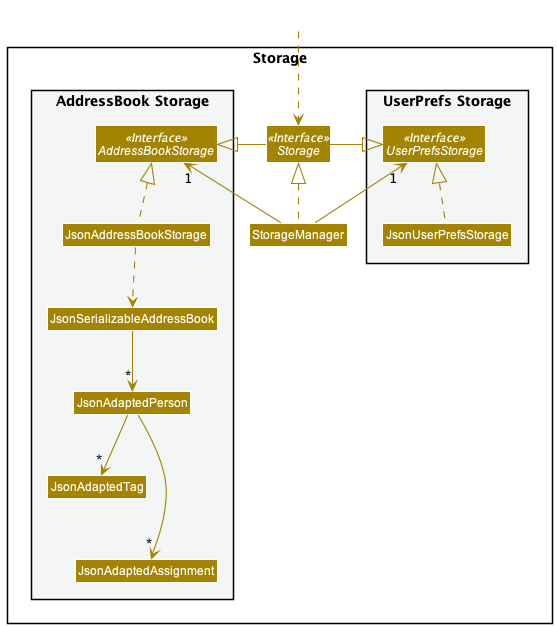
</p>

The `Storage` component,
* can save both address book data and user preference data in json format, and read them back into corresponding objects.
* inherits from both `AddressBookStorage` and `UserPrefStorage`, which means it can be treated as either one (if only the functionality of only one is needed).
* depends on some classes in the `Model` component (because the `Storage` component's job is to save/retrieve objects that belong to the `Model`)

### Common classes

Classes used by multiple components are in the `seedu.address.commons` package.

--------------------------------------------------------------------------------------------------------------------
<div style="page-break-after: always;"></div>

## **Implementation**

This section describes some noteworthy details on how certain features are implemented.

### Find feature

#### Implementation
The `find` command allows users to find specific people in their list, based on certain
matching criteria such as:

1. Name
2. Module
3. Tags

The command is represented by the `find` keyword.

This allows users to specify their list and cut down on the amount of information displayed,
selectively choosing those that the users would only like to see.

The `find` Command is a subclass of the *Command* class. Once the user enters the `find`
keyword, the `LogicManager` class will execute the command and pass the
input to the `AddressBookParser` class to parse the given input.

From this class, a specific parser class known as the `FindPersonCommandParser`
is created and used to parse the input based on the `find` specificity.

Next, the `FindPersonCommandParser` class returns a `FindPersonCommand` or
an exception, depending on the validity of the command input. The
Command#execute is then called, returning a `CommandResult` class.

Given below is a more specific example of the command execution.

1. The user wants to find a specific person based on their name
2. The user executes `find n/alice`, causing a `FindPersonCommand` to be returned
3. The Command#execute is called, which causes the list to update and reflect those whose names matches alice

<div style="page-break-after: always;"></div>

The sequence of this command execution can be visualized using the
below sequence diagram:

<p align="center">
  
</p>

<div markdown="span" class="alert alert-info">:information_source: **Note:** The lifeline for `FindPersonCommand`
should end at the destroy marker (X) but due to a limitation of PlantUML, the lifeline reaches the end of diagram.

</div>

The following activity diagram summarizes what happens when a user executes the `find` command:

<p align="center">
  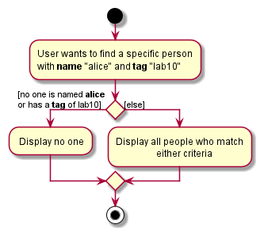
</p>

<div style="page-break-after: always;"></div>

#### Design considerations
**Aspect: Finding people based on OR criteria or AND criteria**

* **Alternative 1 (current choice):** Allows user to find people based on **OR** criteria
  * Pros: Allows for a more flexible search, making it less error-prone
  * Cons: Reduce efficiency of searching for specific people if large chunks of information
    is returned

* **Alternative 2:** Allow users to find people based on **AND** criteria
  * Pros: Users can perform more powerful searching to suit their
    requirements and criteria, thus possibly being more effective and efficient
    if the user knows who is in mind
  * Cons: Less error tolerant as one simple mistake can result in no matches
    being returned.

<div style="page-break-after: always;"></div>

#### [Proposed] Find Extension
**Allow finding to have both specificity and flexibility**

**Proposed Implementation**

In order to create the option for the users to select the type of find they are trying to
execute, be it specific or flexible, such a functionality is implemented in the following way:

The proposed find extension to allow specificity and flexibility can be implemented by altering
how the`FindCommandParser` class works. Users are required to specify an extra parameter to denote
the type of find they are trying to execute.

This extra parameter will be **-S** and **-F** to represent specific and flexible respectively.

An example command call:
- `find -s n/Bryan m/CS1101S` to find all people named Bryan who are enrolled in CS1101S
  - Bryan Loh enrolled in module CS1101s will be listed.
  - Bryan Tan enrolled in module CS1231S will not be listed.

This can be facilitated by splitting the `FindPersonCommand` into two subtypes: `FindSpecificPersonCommand`
and `FindAllPersonCommand`.

With the separation of the commands, two new classes to test for keywords have to be created, namely the
`PersonContainsAllKeywordsPredicate` and `PersonContainsAnyKeywordPredicate`. These two classes will then
extend the `PersonContainsKeywordPredicate` class which implements the `Predicate<T>` interface,
and then override the methods stipulated by the interface.

This way, `FindSpecificPersonCommand` instantiates the `PersonContainsAllKeywordsPredicate` class whilst
`FindAllPersonCommand` instantiates the `PersonContainsAnyKeywordPredicate` class.

<div style="page-break-after: always;"></div>

Given below is the partial class diagram of how the logic behind the new find command works:

<p align="center">
  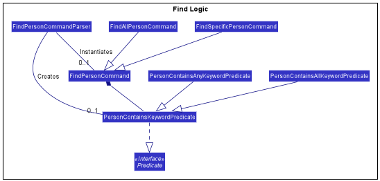
</p>

The following is the activity diagram for a specific find command execution:

<p align="center">
  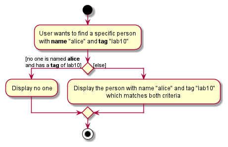
</p>

The following is the activity diagram for a flexible find command execution:

<p align="center">
  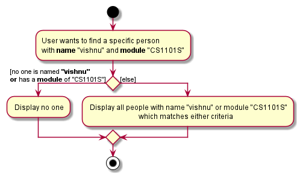
</p>

<div style="page-break-after: always;"></div>

#### Design considerations

**Aspect: How the different find commands can be implemented**

* **Alternative 1 (current choice):** Create subclasses to handle the different kinds of behaviour of `Find`.
  * Pros: Easy to extend classes and implement different functionalities
  * Cons: User has to input more prefixes to specify the command

* **Alternative 2:** Have the parser identify the different find commands without extra prefixes
  * Pros: User can use the find command as per usual without extra prefixes / inputs
  * Cons: Requires the application to recognize a lot of different user inputs which could mean
    different kinds of find, which is unfeasible to implement considering the time given
    
<div style="page-break-after: always;"></div>

### Assignment Feature

#### Implementation
The `Assignment` class encapsulates the current Assignment feature and composes of `Description`, `Status` and `DueDate` class.

It implements the operation `Assignment#isSameAssignment(Assignment assignment)` to check for duplicate assignments. Currently, assignments are similar if they have the same description and this check is case-insensitive. This is because each student is under one module and having a similarly named assignment within the same module is less likely.

Next, the current available `Status` of `Assignment` are `PENDING` and `COMPLETED`. Since the type of `Status` are fixed, the `Status` class contains an `enumeration StatusType` to store the valid values. The use of static methods `Status#createCompletedStatus()` and `Status#createPendingStatus()` initialises the `COMPLETED Status` and `PENDING Status` respectively. Meanwhile, the constructor, `Status(StatusType value)`, is set to private to prevent instantiation through inheritance.

#### Related Implementation: UniqueAssignmentList
A `UniqueAssignmentList` stores a list of `Assignment` and prevents duplicates. `Assignment` class extends `Comparable` interface for sorting purposes within a `UniqueAssignmentList`. Currently, only `AddressBook` and `Person` has a reference to `UniqueAssignmentList`.

<p align="center">
  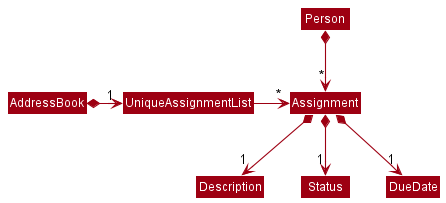
</p>

`UniqueAssignmentList#sort()` is a method responsible for sorting the list based on the `Status` and `DueDate` of the `Assignment`. The `UniqueAssignmentList` gives more importance to assignments that are pending than completed, and if both are pending, it will break the tie by choosing the assignment with an earlier due date.

<p align="center">
  
</p>

#### Design considerations

**Aspect: How Status can be instantiated:**

* **Alternative 1 (current choice):** Instantiate Status using static methods with enumerations to store the fixed values
  * Pros: Easy to implement.
  * Cons: May become harder to update if there are more types of status with different types of behaviour

* **Alternative 2:** Use a factory method to instantiate the different types of status
  * Pros: Divides cleanly all the different types of status and intended behaviour and make it very easy to add new status with few adjustments by creating another subclass.
  * Cons: The code length is very long due to all the subclasses of status and may not be optimal for Status class with very few status types.

<div style="page-break-after: always;"></div>

### Assignment list panel display feature

#### Implementation

The assignment list panel display mechanism is facilitated by `AddressBook`, where the specified person's assignment list is stored internally under `assignments` This `assignments` is retrieved or updated by the following methods:
* `AddressBook#getAssignmentList()`
* `AddressBook#updateAssignmentList(Person person)`  —  where `person` is the specified person.

These methods are exposed in the `Model` interface as `Model#getAssignmentList()` and `Model#updateAssignmentList(Person person)` respectively.
In addition, `Model` contains a field `assignmentsList` that points towards `assignment` in `AddressBook`. `assignmentsList` serve as connection for `Logic` to retrieve `assignments` to display.

Given below is an example usage scenario and how the show assignment mechanism behaves at each step.

Step 1. The user launches the application for the first time. The `assignments` will be initialized with a `UniqueAssignmentList` that does not contain any `Assignment`.

Step 2. The user inputs `show 2` command to display the 2nd person's assignment list in the address book. The `show` command will then call `Model#updateAssignmentList(person)`, whereby `person` variable is the 2nd person in the address book.
This will then call `Addressbook#updateAssignmentList(person)`, causing the `assignments` in `AddressBook` to be replaced with the assignments in 2nd person's assignment list.

<div style="page-break-after: always;"></div>

The two object diagram below shows illustrates how the objects interacts and changes when a `show` command is executed.

<p align="center">
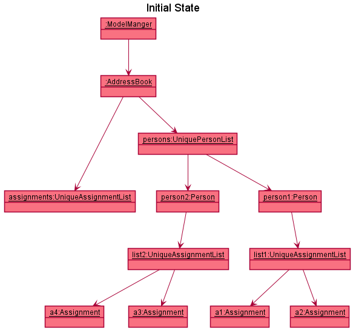
<br>
<br> 
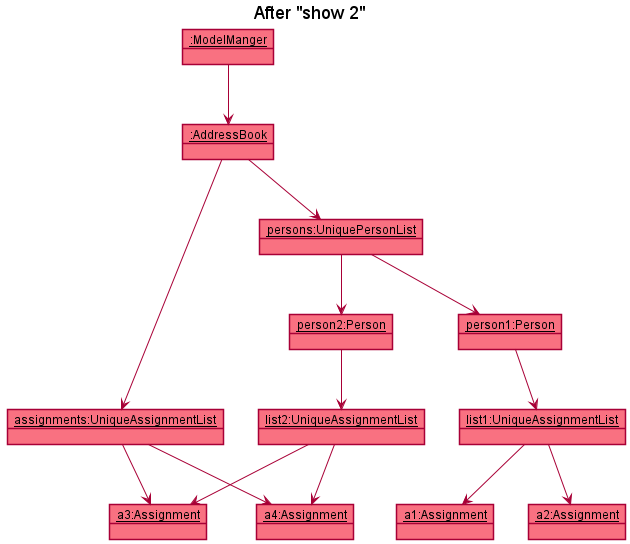
</p>

<div style="page-break-after: always;"></div>

Step 3. When `assignments` is updated, the assignment list panel of the`Ui` will be updated accordingly since it is an observer of the `assignments` list in `Model`

The sequence diagram below illustrates the interactions between the `Logic` and `Model` component, when an assignment command (e.g `show`, `give`, `done`, `remove`) is called.

<p align="center">

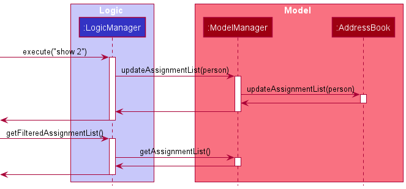

</p>

#### Design considerations:

**Aspect: How the assignment list can be displayed:**

* **Alternative 1(current choice):** Displays assignment list next to the contact list panel in the same window.

  * Pros: Allows you to do everything on one window.

  * Cons: Commands that deal with persons and assignments need to be distinctly named as they share the same window.<br>
  e.g. `add` person and `add` assignments will have conflict.

* **Alternative 2:** Displays assignment list on a new separate window.

  * Pros: Allows you to cleanly segregate commands of assignments and persons because they are on different windows.
  
  * Cons: Additional UI may lead to slower processing and execution.
  
<div style="page-break-after: always;"></div>

### Keeping track on person whose assignments are displayed feature

#### Implementation

The `activePerson` field is a reference to a `Person` object within `UniquePersonList`, wrapped in an `Optional`, whose `Assignment` objects are stored in `UniqueAssignmentList` within `AddressBook`. It forms the bedrock of many commands that involves `Assignment` in `UniqueAssignmentList`.

`activePerson` field is wrapped in an `Optional` because there is a possibility that there is no `activePerson`, which means that there is no `Person` object whose assignment list is currently stored in the `UniqueAssignmentList`.

The `ModelManager` has a reference to the `VersionedAddressBook` which is a subclass of `AddressBook` and has the following accessors to `activePerson`:
* `Model#hasActivePerson()` —  Checks the presence of active person.
* `Model#getActivePerson()` —  Retrieves the active person if it exists to perform operations on the person's assignment list.

Operations that may change the person whose assignments are displayed will use the above accessors before calling `Model#updateAssignmentList(Person person)` to change the target of `activePerson` to the `person` parameter, wrapped in an `Optional` if it exists in `UniquePersonList`. If not, `activePerson` will be updated to an empty `Optional` that means an absence of `activePerson`.

The `delete` command is one of the commands that may affect the assignment list displayed. Since `Person` objects and their `Assignments` share a whole-part relationship, when a `Person` object is deleted, their list of `Assignment` should be deleted as well. Hence, if a particular `Person` object is the `activePerson`, the `UniqueAssignmentList` in `AddressBook` should be cleared of `Assignment` objects belonging to that `Person` if he/she is deleted. Below is an activity diagram to illustrate this point.

<p align="center">
  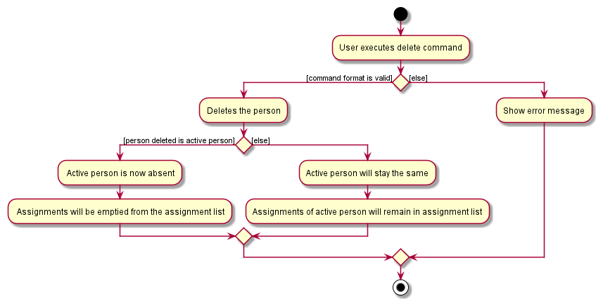
</p>

#### Design considerations

**Aspect: How to keep track of the person whose assignment list is displayed:**

* **Alternative 1 (current choice): use a reference to point to person whose assignments should be displayed**
  * Pros: Easy to implement.
  * Cons: Ignoring the property of `UniqueAssignmentList` that prevents duplicate `Assignment` from being stored, this method will be limited to displaying a particular person's assignments. Difficult to extend to displaying `Assignment` objects of multiple `Person` objects.

* **Alternative 2:** `Person` class store an additional attribute `boolean isActivePerson`.
  * Pros: Can toggle between multiple persons.
  * Cons: `isActivePerson` may not be a suitable property of `Person` class since it may not be the responsibility of `Person` to remember whether it is the `activePerson`.

<div style="page-break-after: always;"></div>

### Give feature

#### Implementation
The `give` command allows users to add the specified assignment to a particular person is stored in the model.
Person who already has the specified assignment will not have a duplicated assignment added to him. The
command is abstracted as `AddAssignmentCommand` and extends `Command`. When the user inputs the command,
`Command#execute` is called and returns a `CommandResult`.

Given below is an example usage scenario and how the `AddAssignmentCommand` is executed.

Step 1. The user executes `list` command to see the current list of persons.

Step 2. The user executes `give 2 d/Assignment 1 by/ 03/11/2021` command to add assignment to the second person in
the specified module. When `Command#execute` is called, the `give 2...` command will filter out persons in the currently
displayed list with `INDEX` 2 and add the specified assignment to this person if he or she exists and does
not have that assignment.

<div markdown="span" class="alert alert-info">:information_source: **Note:** If the person at the specified 
`INDEX` does not exist, it will return an error to the user.

</div>

The following sequence diagram shows how the `give` command is executed:

<p align="center">
  
</p>

<div markdown="span" class="alert alert-info">:information_source: **Note:** The lifeline for `AddAssignmentCommand`
should end at the destroy marker (X) but due to a limitation of PlantUML, the lifeline reaches the end of diagram.

</div>

The following activity diagram summarizes what happens when a user executes the `give` command:

<p align="center">
  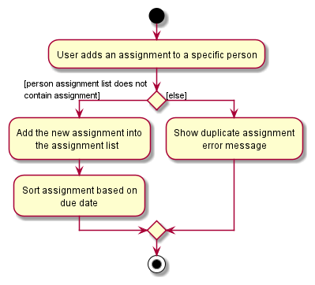
</p>

<div style="page-break-after: always;"></div>

#### Design considerations
**Aspect: Adds an assignment to a person in the currently displayed list or to any other person in storage:**

* **Alternative 1 (current choice):** Add an assignment to a person in the currently displayed list.
  * Pros: If the displayed list is shorter, the addition of assignments will be faster.
  * Cons: User has to ensure that the desired person is displayed on the displayed contact list first before adding of assignment.

* **Alternative 2:** Add an assignment to any person in the storage.
  * Pros: Allows user to add assignment to a particular person even when he is not visible in the list.
  * Cons: Might take longer to execute.

* Considering the fact that the `give` command is meant for users to add assignments to visible persons in contact list,
* **Alternative 1** was chosen as it meets this specification. Moreover, it will not duplicate the assignment for
  persons who already have the assignment.
  **Alternative 1** requires an additional effort for user to ensure the person who the user want to give the assignment
  to is actually stored in the contact list but not displayed, which may lead to the user giving assignments to the wrong person.

<div style="page-break-after: always;"></div>

### Giveall feature

#### Implementation
The `giveall` command allows users to add the specified assignment to all persons in the same module. Persons who already
have the specified assignment will not have a duplicated assignment added to them. The command is abstracted as
`AddAssignmentToAllCommand` and extends `Command`. When the user inputs the command, `AddAssignmentToAllCommand#execute()` is called and returns a `CommandResult`.

When `AddAssignmentToAllCommand#execute()` is called, `AddAssignmentToAllCommand` checks if any persons in `AddressBook` has the specified
assignment already. To avoid any inconsistencies in the specified assignment and any existing assignment with the same `Description`,
`AddAssignmentToAllCommand#execute()` calls `AddAssignmentToAllCommand#getAssignmentIfExists(List<Person> personListWithAssignment)`
to check if any persons contain an assignment with the same `Description` as the specified assignment. If such an assignment
exists, a check is done to make sure that the `DueDate` field of the specified assignment and the existing assignment are
the same. Additionally, the `Description` field of the added assignment will follow that of the existing assignment to
prevent any inconsistencies in letter cases. The assignment will then be added to all persons who do not have the assignment.

<div markdown="span" class="alert alert-info">:information_source: **Note:** If there are no persons with the specified
module field, it will return an error to the user. <br>
Additionally, if all persons in the module already have the specified assignment,
it will return an error to the user as well.

</div>

Given below is an example usage scenario and how the `AddAssignmentToAllCommand` is executed.

Step 1. The user executes `giveall m/CS2100 d/Assignment 2 by/ 03/10/2021` command to add `Assignment 2` to all persons in
the module `CS2100` for the first time. When `AddAssignmentToAllCommand#execute()` is called, `AddAssignmentToAllCommand` will filter out persons in `AddressBook`
with the module field `CS2100`. Since no persons have this assignment, it is added for all persons in `CS2100`.

Step 2. The user now decides to add another person in the module `CS2100` as this person was accidentally left out earlier.
The user executes `add Alice Koh m/CS2100 e/e2716238@u.nus.edu` to add the person in.

Step 3. The user wants to give this person the assignment he previously gave to the other persons in `CS2100`. The user
executes `giveall m/CS2100 d/assignment 2 by/ 03/10/2021`. Like Step 1, when `AddAssignmentToAllCommand#execute()` is called,
`AddAssignmentToAllCommand` will filter out persons in `AddressBook` with the module field `CS2100`. However, since
some persons in `CS2100` already have `Assignment 2`, the existing assignment will be returned when
`AddAssignmentToAllCommand#getAssignmentIfExists(List<Person> personListWithAssignment)` is called. Since the `DueDate` of
both the specified and existing assignment are `03/10/2021`, no error message will be thrown. `Assignment 2` will then be added
for all persons in `CS2100` who does not have it yet.

The following sequence diagram shows how `giveall m/CS2100 d/assignment 2 by/ 03/10/2021` is executed:
<p align="center">
  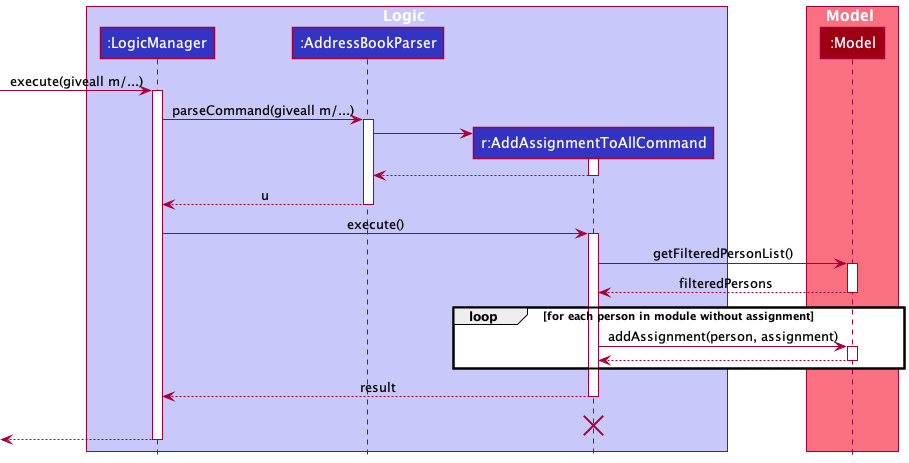
</p>

<div markdown="span" class="alert alert-info">:information_source: **Note:** The lifeline for `AddAssignmentToAllCommand`
should end at the destroy marker (X) but due to a limitation of PlantUML, the lifeline reaches the end of diagram.

</div>

<div style="page-break-after: always;"></div>

The following activity diagram summarizes what happens when a user executes the `giveall` command:

<p align="center">
  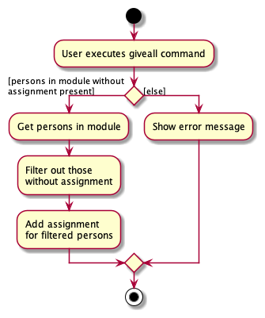
</p>

#### Design considerations
**Aspect: Adds assignment to persons in the specified module who are in the currently displayed list or
to all persons in the specified module:**

* **Alternative 1:** Adds assignment to persons in the specified module who are in the currently displayed list
  * Pros: Allows user to add assignment to a more specific group of persons
  * Cons: User has to carry out `list` command first if addition of assignments is desired for all persons

* **Alternative 2 (current choice):** Adds assignment to all persons in the specified module
  * Pros: Allows user to add assignment to all persons even when some persons are not displayed in the list
  * Cons: Less flexibility in terms of the choice of persons to add assignments to

* Considering the fact that the `giveall` command is meant for users to add assignments to all persons in the specified
  module, **alternative 2** was chosen as it meets this specification. Moreover, the existence of the
  `give` command which allows users to add an assignment to a specific person suggests that the `giveall` command might
  provide better utility for users if it allows for the addition of assignments to a bigger group of persons.

<div style="page-break-after: always;"></div>

### Done feature

#### Implementation
The `done` command allows users to mark the specified assignment of a particular person in model.
It is abstracted as `MarkAssignmentCommand` and extends `Command`. When the user inputs the command,
`Command#execute` is called and returns a `CommandResult`.

Given below is an example usage scenario and how the `MarkAssignmentCommand` is executed.

Step 1. The user executes `list` command to see the current list of persons.

Step 2. The user executes `done 1` command to mark the first assignment of the currently displayed assignment list as done. When `Command#execute` is called,
the `done 1` command will filter out assignments with `INDEX` 1 and mark the specified assignment as completed
if assignment of `INDEX` 1 exists in the currently displayed assignment list.

<div markdown="span" class="alert alert-info">:information_source:
**Note:** If there is no assignment at that specified index, it will return an error to the user.
</div>

The following sequence diagram shows how the `done` command is executed:
<p align="center">
  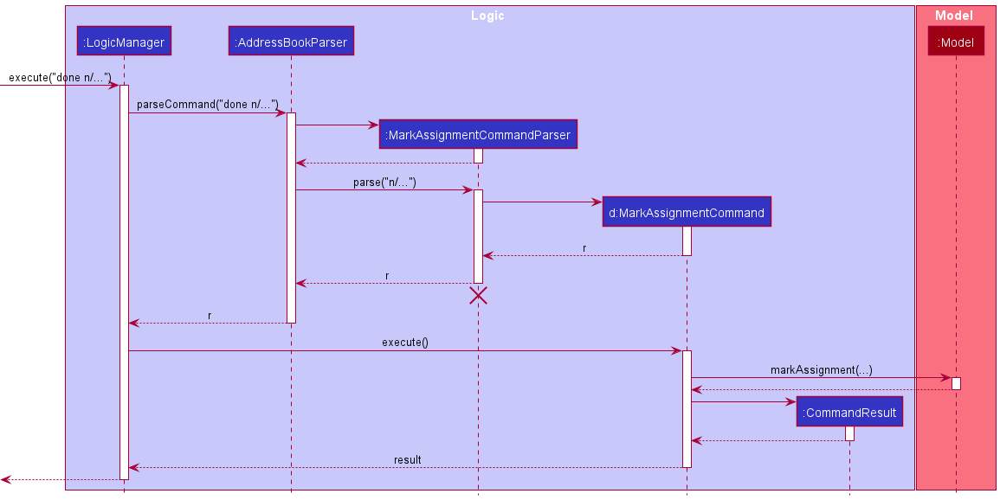
</p>

<div markdown="span" class="alert alert-info">:information_source: **Note:** The lifeline for `MarkAssignmentCommand`
should end at the destroy marker (X) but due to a limitation of PlantUML, the lifeline reaches the end of diagram.

</div>

The following activity diagram summarizes what happens when a user executes the `done` command:

<p align="center">
  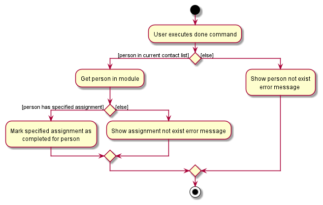
</p>

<div style="page-break-after: always;"></div>

#### Design considerations
**Aspect: Marks assignment of a person in the currently displayed list as done or for any person in storage model:**

* **Alternative 1:** (current choice) Marks assignment in the currently displayed assignment list as completed.
  * Pros: Allows for a safer mark of assignments.
  * Cons: User has to ensure that the desired assignment is displayed on the displayed assignment list first before marking the assignment as completed.

* **Alternative 2:** Marks an assignment as completed of the specified person, by in putting the name with the command.
  * Pros: Allows user to mark assignment of a person without the need of additional commands.
  * Cons: User may not be certain about which person's assignment to mark if several of them has completed assignment
    and likely to remember the wrong person name if the current person displayed list is not shown.

* Considering the fact that **TA<sup>2</sup>** is designed to be user-friendly in managing student submissions, **alternative 1** is
  chosen. The potential undesired mark of assignments in **alternative 2** means the user has to manually recover the
  marked assignment by undoing and marking assignment again. Compared to the additional time taken to execute the `list` command
  in **alternative 1**, it may take up much more time.

<div style="page-break-after: always;"></div>

### Remove feature

#### Implementation
The `remove` command allows users to remove the specified assignment of a particular person in model.
It is abstracted as `DeleteAssignmentCommand` and extends `Command`. When the user inputs the command,
`Command#execute` is called and returns a `CommandResult`.

Given below is an example usage scenario and how the `DeleteAssignmentCommand` is executed.

Step 1. The user executes `list` command to see the current list of persons.

Step 2. The user executes `remove 1` command to remove the first assignment of a person whose assignments are currently displayed. When `Command#execute`
is called, the `remove 1` command will filter out the assignment in the currently displayed assignment list with the `INDEX` 1 and remove
the assignment if there is an assignment at that `INDEX` in assignment list.

<div markdown="span" class="alert alert-info">:information_source:
**Note:** If currently displayed assignment list does not contain the assignment at specified `INDEX`, it will return an error to the user.
</div>

The following sequence diagram shows how the `remove` command is executed:
<p align="center">
  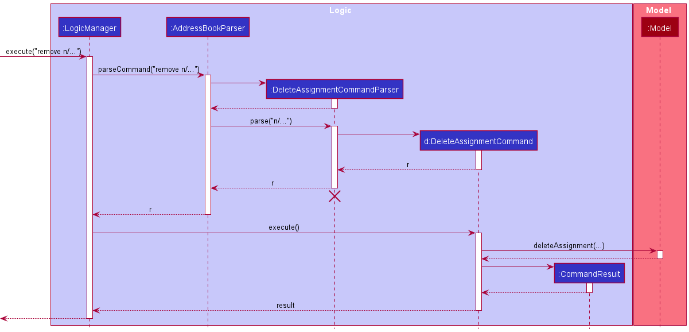
</p>

<div markdown="span" class="alert alert-info">:information_source: **Note:** The lifeline for `DeleteAssignmentCommand`
should end at the destroy marker (X) but due to a limitation of PlantUML, the lifeline reaches the end of diagram.

</div>

The following activity diagram summarizes what happens when a user executes the `remove` command:
<p align="center">
  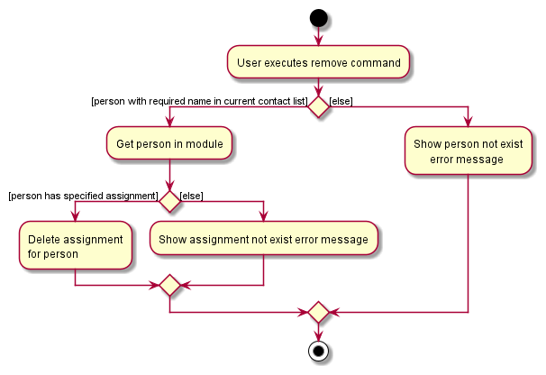
</p>

#### Design considerations
**Aspect: Deletes assignment of a person in the currently displayed list or for any person in storage:**

* **Alternative 1:** (current choice) Deletes assignment of a person in the currently displayed list.
  * Pros: Allows for a safer delete of assignments.
  * Cons: User has to ensure that the desired assignment is displayed on the displayed assignment list first before deleting that assignment.

* **Alternative 2:** Deletes the assignment of the specified person, by inputting their name with the command.
  * Pros: Allows user to delete assignment of a person without the need of additional commands.
  * Cons: User may not be certain about which person's assignment to delete if several of them have completed the assignment
    and likely to remember the wrong person name if the currently displayed contact list is not shown.

* Considering the fact that **TA<sup>2</sup>** is designed to be efficient in managing student submissions, **alternative 1** is
  chosen. The potential undesired deletion of assignments in **alternative 2** means the user has to manually recover the
  deleted assignment by adding the assignment again. Compared to the additional time taken to execute the `list` command
  in **alternative 1**, it may take up much more time.

<div style="page-break-after: always;"></div>

### Clean feature

#### Implementation
The `clean` command allows users to remove all completed assignment from all persons.
It is abstracted as `CleanAssignmentCommand` and extends `Command`. When the user inputs the command,
`Command#execute` is called and returns a `CommandResult`.

Given below is an example usage scenario and how the `CleanAssignmentCommand` is executed.

Step 1. The user executes `list` command to see the current list of persons.

Step 2. The user executes `clean` command to remove all the completed assignments.
When `Command#execute` is called, the `clean` command will get the assignment list of all persons in the model and
remove all assignments with the completed status.

The following sequence diagram shows how the `clean` command is executed:
<p align="center">
  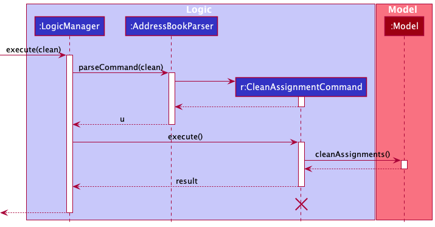
</p>

<div markdown="span" class="alert alert-info">:information_source: **Note:** The lifeline for `CleanAssignmentCommand`
should end at the destroy marker (X) but due to a limitation of PlantUML, the lifeline reaches the end of diagram.

</div>

Step 3. The user executes `show 1` to check that all completed assignments has been removed for the first person.

<div style="page-break-after: always;"></div>

The following activity diagram summarizes what happens when a user executes the `clean` command:

<p align="center">
  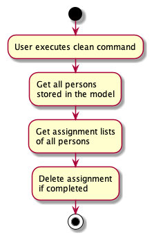
</p>

#### Design considerations
**Aspect: Deletes completed assignments of person with assignments currently displayed or for all persons:**

* **Alternative 1:** Deletes completed assignments of person with assignments currently displayed
  * Pros: Allows for a safer delete of assignments
  * Cons: User has to carry out `show INDEX` command for every person if deletion of assignments is desired for all persons

* **Alternative 2(current choice):** Deletes completed assignment of all persons
  * Pros: Allows user to delete assignment of all persons without the need of additional commands
  * Cons: Undesired deletion of assignment of persons not in displayed list may occur

* Considering the fact that **TA<sup>2</sup>** is designed to be efficient in managing student submissions, **alternative 2** is
  chosen. When the list of persons increase to considerable numbers, deletion of completed assignments will require the user
  to input an additional command for each person. Bearing in mind that users make use of the `clean` command to remove
  completed assignments that they no longer want to view, **alternative 2** does this job more efficiently. Although there
  may be completed assignments that users want to keep in the list which they accidentally delete, there is the `undo` command
  which allows the user to retrieve the desired assignments easily.


<div style="page-break-after: always;"></div>

### Undo/redo feature

#### Implementation

The undo/redo mechanism is facilitated by `VersionedAddressBook`. It extends `AddressBook` with an undo/redo history, stored internally as an `addressBookStateList` and `currentStatePointer`. Additionally, it implements the following operations:

* `VersionedAddressBook#commitAddressBook()` — Saves the current address book state in its history.
* `VersionedAddressBook#undo()` — Restores the previous address book state from its history.
* `VersionedAddressBook#redo()` — Restores a previously undone address book state from its history.

These operations are exposed in the `Model` interface as `Model#commitAddressBook()`, `Model#undoAddressBook()` and `Model#redoAddressBook()` respectively.

Given below is an example usage scenario and how the undo/redo mechanism behaves at each step.

Step 1. The user launches the application for the first time. The `VersionedAddressBook` will be initialized with the initial address book state, and the `currentStatePointer` pointing to that single address book state.

<p align="center">
  
</p>

Step 2. The user executes `delete 5` command to delete the 5th person in the address book. The `LogicManager` instance calls `Model#commitAddressBook()`, causing the modified state of the address book after the `delete 5` command executes to be saved in the `addressBookStateList`, and the `currentStatePointer` is shifted to the newly inserted address book state.

<p align="center">
  
</p>

Step 3. The user executes `add n/David …​` to add a new person. The same `LogicManager` instance calls `Model#commitAddressBook()`, causing another modified address book state to be saved into the `addressBookStateList`.

<p align="center">
  
</p>

<div markdown="span" class="alert alert-info">:information_source: **Note:** If a command fails its execution, it will not call `Model#commitAddressBook()`, so the address book state will not be saved into the `addressBookStateList`.

</div>

Step 4. The user now decides that adding the person was a mistake, and decides to undo that action by executing the `undo` command. The `undo` command will call `Model#undoAddressBook()`, which will shift the `currentStatePointer` once to the left, pointing it to the previous address book state, and restores the address book to that state.

<p align="center">
  
</p>

<div style="page-break-after: always;"></div>

The following sequence diagram shows how the undo operation works:

<p align="center">
  
</p>

<div markdown="span" class="alert alert-info">:information_source: **Note:** The lifeline for `UndoCommand` should end at the destroy marker (X) but due to a limitation of PlantUML, the lifeline reaches the end of diagram.

</div>

The `redo` command does the opposite — it calls `Model#redoAddressBook()`, which shifts the `currentStatePointer` once to the right, pointing to the previously undone state, and restores the address book to that state.

<div markdown="span" class="alert alert-info">:information_source: **Note:** If the `currentStatePointer` is at index `addressBookStateList.size() - 1`, pointing to the latest address book state, then there are no undone AddressBook states to restore. When `redo` command executes `Model#redoAddressBook()` it will internally check if this is the case. If so, it will return an error to the user rather than attempting to perform the redo.

</div>

Step 5. The user then decides to execute the command `help`. Commands that do not modify the address book, such as `help`, will usually not call `Model#commitAddressBook()`, `Model#undoAddressBook()` or `Model#redoAddressBook()`. Thus, the `addressBookStateList` remains unchanged.

<p align="center">
  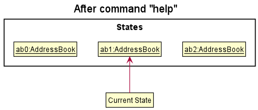
</p>

Step 6. The user executes `clear`, which calls `Model#commitAddressBook()`. Since the `currentStatePointer` is not pointing at the end of the `addressBookStateList`, all address book states after the `currentStatePointer` will be purged. Reason: It no longer makes sense to redo the `add n/David …​` command. This is the behavior that most modern desktop applications follow.

<p align="center">
  
</p>

<div style="page-break-after: always;"></div>

The following activity diagram summarizes what happens when a user executes a new command:

<p align="center">
  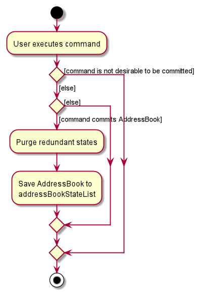
</p>

#### Design considerations

**Aspect: How undo & redo executes:**

* **Alternative 1 (current choice):** Saves the entire address book.
  * Pros: Easy to implement.
  * Cons: May have performance issues in terms of memory usage.

* **Alternative 2:** Individual command knows how to undo/redo by
  itself.
  * Pros: Will use less memory (e.g. for `delete`, just save the person being deleted).
  * Cons: We must ensure that the implementation of each individual command are correct.
  
<div style="page-break-after: always;"></div>

### Friendlier Command Inputs
In striving to adopt a more user-centric approach in command recognition, additional commands are
included on top of the original commands which stuck by a strict and predefined prefix. This offered
very little flexibility to our users in an event they make a mistake.

Here are the commands that currently support a *friendly* input command:
1. `give`
2. `giveall`


<div markdown="span" class="alert alert-info">:information_source: **Note:**

The `give` and `giveall` command classes will not create "`Give`" classes but instead:

The `give` command results in the creation of the `AddAssignmentCommandParser` class whilst the `giveall` command results 
in the creation of the `AddAssignmentToAllCommandParser`. 

</div>


The `give` command has the sole purpose of adding a single assignment to an individual in the list.

The `giveall` command has the sole purpose of adding a single assignment to all individuals under the same module in the list.

<div style="page-break-after: always;"></div>

The following table contains the new *friendly* commands that a user may provide, instead of the
original command inputs.

| Friendly Command                            | Corresponding Command                         |   Example Usages                                                        |
| ------------------------------------------- | --------------------------------------------- | ----------------------------------------------------------------------- |
| tmr                                         | sets the date to be tomorrow                  | give n/name d/description by/tmr                                        |
| today                                       | sets the date to be the current date          | give n/name d/description by/today                                      |
| week                                        | sets the date to be a week from now           | give n/name d/description by/week                                       |
| mon                                         | sets the date to be the upcoming Monday       | give n/name d/description by/mon                                        |
| tue                                         | sets the date to be the upcoming Tuesday      | give n/name d/description by/tue                                        |
| wed                                         | sets the date to be the upcoming Wednesday    | give n/name d/description by/wed                                        |
| thu                                         | sets the date to be the upcoming Thursday     | give n/name d/description by/thu                                        |
| fri                                         | sets the date to be the upcoming Friday       | give n/name d/description by/fri                                        |
| sat                                         | sets the date to be the upcoming Saturday     | give n/name d/description by/sat                                        |
| sun                                         | sets the date to be the upcoming Sunday       | give n/name d/description by/sun                                        |

<div style="page-break-after: always;"></div>

When the user enters a command with the *friendly* command input, the `AddressBookParser` class will recognize the command
and parse the entered command. 

If the command the user chose is `give`, this triggers the `AddAssignmentCommandParser#parse` 
method to be called with the user input arguments. If the command chosen is `giveall`, this
triggers the `AddAssignmentToAllCommandParser#parse` method to be called instead. 

From there, each individual argument token is parsed and for the *friendly* command, it will be 
recognized within the `DueDate` class as a date with a *friendly* command format. This then calls 
the Java library `TemporalAdjusters` class to return a `LocalDate` instance that represents the 
desired *friendly* command input date. 

From here, the `AddAssignmentCommand` class is then instantiated if the user command is `give`, or
conversely, the `AddAssignmentToAllCommand` class. 

Finally, the results are then actualized by the `Model` component.

The following activity diagram shows the possible paths whilst a user adds an assignment using `give`:

<p align="center">
  
</p>

<div style="page-break-after: always;"></div>

The following sequence diagram shows the logic sequence of an `AddAssignment` command execution:

<p align="center">
  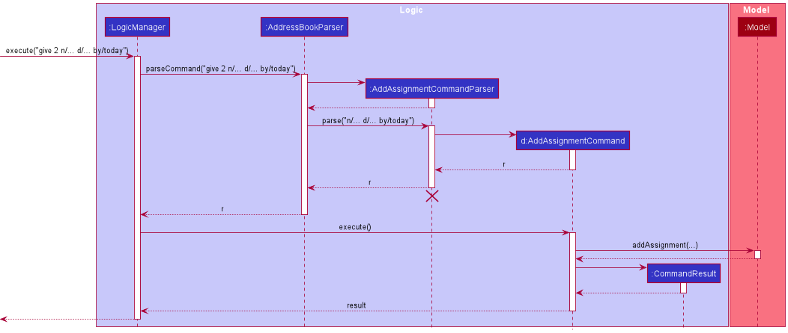
</p>

<div markdown="span" class="alert alert-info">:information_source: **Note:** The lifeline for AddAssignmentCommand
should end at the destroy marker (X) but due to a limitation of PlantUML, the lifeline reaches the end of diagram.
</div> <br>

<div style="page-break-after: always;"></div>

The following activity diagram shows the possible paths whilst a user adds an assignment using `giveall`:

<p align="center">
  
</p>

<div style="page-break-after: always;"></div>

The following sequence diagram shows the logic sequence of an `AddAssignmentToAll` command execution:

<p align="center">
  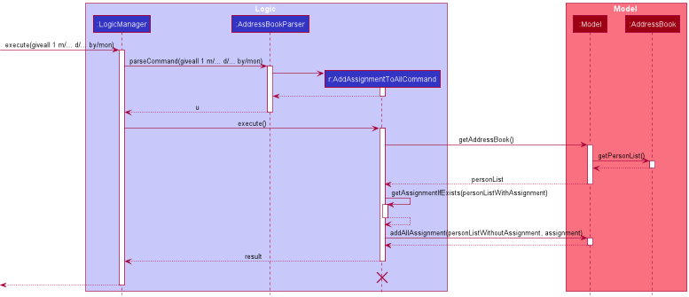
</p>

<div markdown="span" class="alert alert-info">:information_source: **Note:** The lifeline for `AddAssignmentToAllCommand`
should end at the destroy marker (X) but due to a limitation of PlantUML, the lifeline reaches the end of diagram.
</div>

#### Design considerations
**Aspect: Rigidity in allowing users to add assignments correctly yet handle multiple short-form user inputs:**

* **Alternative 1 (current choice):** Allows users to add based on format and some *friendly* commands
    * Pros: Allows for a safer addition of assignment, ensuring strict adherence to format
    * Cons: User has to memorize the command usage or get it wrong the first time to view the error message

* **Alternative 2:** Simplify the rigid commands and make all commands user-friendly
    * Pros: Users can perform more powerful addition of assignments without having to type too much or following too strict
    of a guideline
    * Cons: Requires the application to recognize a lot of different words, be it short or long form, to allow
    maximum user-friendliness, which may not be too feasible to achieve

#### [Proposed] Friendly Commands
1. `find`

(more aspects and details of implementation to come)

--------------------------------------------------------------------------------------------------------------------
<div style="page-break-after: always;"></div>

## **Documentation, logging, testing, configuration, dev-ops**

* [Documentation guide](Documentation.md)
* [Testing guide](Testing.md)
* [Logging guide](Logging.md)
* [Configuration guide](Configuration.md)
* [DevOps guide](DevOps.md)

--------------------------------------------------------------------------------------------------------------------


## **Appendix: Requirements**

### Product scope

**Target user**

**TA<sup>2</sup>** is developed for Teaching Assistants (TA) in the School of Computing (SoC) at the National
University of Singapore (NUS).

**Profile:**
* has a need to consolidate and organise student information
* has a need to manage student assignments
* has little time to organise information manually
* is familiar with using CLI applications
* can type fast

**Value proposition**

**TA<sup>2</sup>** offers a convenient way for SoC TAs to manage student assignments in an efficient manner.
With **TA<sup>2</sup>**, they will no longer need to have to rely on inefficient workarounds like Excel or Notepad.
As users who can type fast, they will be able to manage their students' information and allocated assignments much faster than when using a mouse/GUI driven app.

**TA<sup>2</sup>** does not support management of assignments of a particular student across multiple modules (i.e. a student can only be under a single module).

<div style="page-break-after: always;"></div>

### User stories

Priorities: High (must have) - `* * *`, Medium (nice to have) - `* *`, Low (unlikely to have) - `*`

| Priority | As a …​                                 | I want to …​                                   | So that I can…​                                                           |
| -------- | ------------------------------------------ | ------------------------------------------------- | ---------------------------------------------------------------------------- |
| `* * *`  | TA using **TA<sup>2</sup>** for the first time | see all commands available                        | recall commands and use them properly when I forget how to use the app       |
| `* * *`  | TA                                         | add information of a student                      | view a student's information                                                 |
| `* * *`  | TA                                         | delete a student                                  | remove student entries that I no longer need                                 |
| `* * *`  | TA                                         | find a person by name or module                   | locate details of persons without having to go through the entire list       |
| `* * *`  | TA                                         | assign tasks to students                          | -                                                                            |
| `* * *`  | TA                                         | delete tasks assigned before                      | remove assignments that I do not need to view anymore                        |
| `* * *`  | TA                                         | mark students' tasks as done                      | record students' progress more easily                                        |
| `* * *`  | responsible TA                             | track students' progress on their assignments     | identify and reach out to those who need help                                |
| `* * *`  | TA                                         | list all students I am teaching                   | ensure I added right and correct number of students                          |
| `* * *`  | TA                                         | clear all student information in **TA<sup>2</sup>**   | use **TA<sup>2</sup>** over many semesters                                       |
| `* *`    | TA for several modules                     | organize student assignments according to module  | manage assignments of students from different modules in an organised manner |
| `* *`    | TA with many students                      | organise my students in a systematic fashion      | locate a student easily                                                      |
| `* *`    | responsible TA                             | be notified when certain assignments are due soon | remind students who have not submitted their assignments yet                 |
| `* *`    | clumsy TA                                  | undo actions                                      | recover information that I accidentally delete                               |
| `* * `   | TA                                         | assign a similar task to all students at once     | save time manually assigning one by one                                      |
| `* * `   | TA                                         | remove all assignments that are completed         | save time manually removing each assignment one by one                       |
| `*`      | TA teaching online                         | access the web links used for teaching            | access information from teaching websites immediately                        |
| `*`      | busy TA                                    | list people whose information I access frequently | save time searching their name whenever I start the application              |
| `*`      | TA with many assignments to manage         | see assignments that need my attention the most at the present moment | I can prioritise which assignment to attend to           |

<div style="page-break-after: always;"></div>

### Use cases

(For all use cases below, the **System** is`TA^2` and the **Actor** is the `user`, unless specified otherwise)

**Use case: UC01 - Add a person**

**MSS**

1. User enters a new person's information.
2. **TA<sup>2</sup>** shows the person is added.

    Use case ends.

**Extensions**

* 1a. The given command format is invalid, or the person's name or email is already in the list.

    * 1a1. **TA<sup>2</sup>** shows an error message.

      Use case resumes at step 1.

**Use case: UC02 - Find a person**

**MSS**
1. User requests to find a person with the specified keyword(s).
2. **TA<sup>2</sup>** shows a list of persons with matching keyword(s).

   Use case ends.

**Extensions**

* 1a. The format of the command is invalid.
  
  * 1a1. **TA<sup>2</sup>** shows an error message.
  
    Use case resumes at step 1.
  
* 2a. No persons match the specified keyword(s).

    Use case ends.

<div style="page-break-after: always;"></div>

**Use case: UC03 - Delete a person**

**MSS**

1.  User requests to list persons.
2.  **TA<sup>2</sup>** shows a list of persons.
3.  User requests to delete a specific person in the list.
4.  **TA<sup>2</sup>** deletes the person.

    Use case ends.

**Extensions**

* 2a. The list is empty.

  Use case ends.

* 3a. The given index is invalid.

    * 3a1. **TA<sup>2</sup>** shows an error message.

      Use case resumes at step 2.

**Use case: UC04 - Edit a person**

**MSS**
1. User requests to edit a person's name and email in the list.
2. **TA<sup>2</sup>** shows that the person's information has been edited.

   Use case ends.

**Extensions**

* 1a. The format of the command or the index is invalid, or there already exists a person with the same name and email.

  * 1a1. **TA<sup>2</sup>** shows an error message.

    Use case resumes at step 1.

<div style="page-break-after: always;"></div>

**Use case: UC05 - Give an assignment**

**MSS**

1. User enters the assignment information.
2. **TA<sup>2</sup>** shows the assignment is added.

   Use case ends.

**Extensions**

* 1a. The format of the command is invalid, or the assignment already exists in that person's assignment list.

  * 1a1. **TA<sup>2</sup>** shows an error message.

    Use case resumes at step 1.

**Use case: UC06 - Remove an assignment**

**MSS**

1. User requests to show assignments of a person.
2. **TA<sup>2</sup>** shows a list of assignments.
3. User requests to delete a specific assignment in the list.
4. **TA<sup>2</sup>** deletes the assignment.

   Use case ends.

**Extensions**

* 2a. The list is empty.

  Use case ends.

* 3a. The given index is invalid.

  * 3a1. **TA<sup>2</sup>** shows an error message.

    Use case resumes at step 2.

<div style="page-break-after: always;"></div>

**Use case: UC07 - Mark an assignment as done**

**MSS**

1. User requests to show assignments of a person.
2. **TA<sup>2</sup>** shows a list of assignments.
3. User requests to mark a specific assignment in the list as done.
4. **TA<sup>2</sup>** shows the assignment is done.

   Use case ends.

**Extensions**

* 2a. The list is empty.

  Use case ends.

* 3b. The given index is invalid, or the assignment has already been mark completed.

  * 3b1. **TA<sup>2</sup>** shows an error message.

    Use case resumes at step 1.

<div style="page-break-after: always;"></div>

### Non-Functional Requirements

1. Should work on any _mainstream OS_ as long as it has Java `11` or above installed.
2. Should be able to hold up to 200 persons, each with 100 assignments, without a noticeable sluggishness in performance for typical usage.
3. A user with above average typing speed (approximately 70 words per minute) for regular English text (i.e. not code, not system admin commands) should be able to accomplish most of the tasks faster using commands than using the mouse.
4. System should respond within 2 seconds of user request.
5. Should be a single user product.
6. Data should be stored in a human editable text file.
7. Data cannot be stored in DBMS.
8. Size of products should not exceed 100 MB.
9. No broken links should be present.
10. The user interface should be intuitive enough for users who are not IT-savvy.
11. Commands should not be cumbersome to use.


### Glossary

* **Mainstream OS**: Windows, Linux, Unix, OS-X
* **Person**: Synonymous with student as of v1.4
* **e/**: Symbol for a requirement to state email address
* **m/**: Symbol for a requirement to state the module
* **n/**: Symbol for a requirement to state a name
* **t/**: Symbol for a requirement to state a tag
* **TA**: Abbreviation for teaching assistant
* **UC**: Abbreviation for use case
* **SoC**: Abbreviation for School of Computing
* **CLI**: Abbreviation for Command Line Interface

--------------------------------------------------------------------------------------------------------------------
<div style="page-break-after: always;"></div>

## **Appendix: Instructions for manual testing**

Given below are instructions to test the app manually.

<div markdown="span" class="alert alert-info">:information_source: **Note:** These instructions only provide a starting point for testers to work on;
testers are expected to do more *exploratory* testing.

</div>

### Launch and shutdown

1. Initial launch

   1. Download the jar file and copy into an empty folder.

   2. Navigate to the folder using your command prompt.

   3. Launch the jar file using the ```java -jar ta2.jar```.

   4. Expected: Shows the GUI with a set of sample contacts. No assignments are displayed under the Assignments panel. The window size may not be optimum. The image below is the window you will see upon starting **TA<sup>2</sup>**. <br>

   <p align="center">
     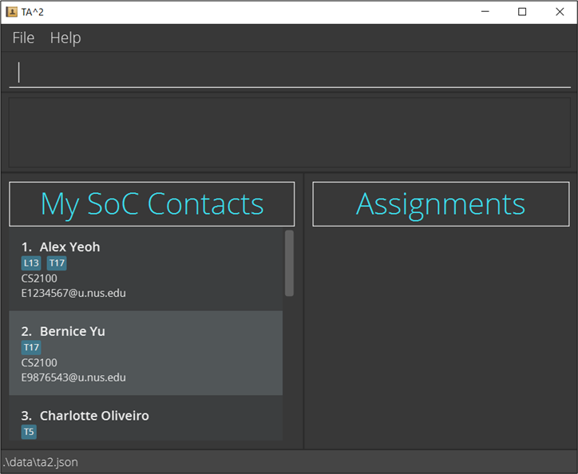
   </p>
   <br>

2. Saving window preferences

   1. Resize the window to an optimum size. Move the window to a different location. Close the window.

   2. Re-launch the app by double-clicking the jar file.<br>
       Expected: The most recent window size and location is retained.
      
### Viewing Help

1. Test case: `help`<br/>
   Expected: Pops up a help window as shown in the image below. Success message shown in the status message.
   <br>
   <br>
   
   <br>
   <br>
2. Click on the Copy URL button and paste the link in your web browser. <br/>Expected: URL leads you to the [user guide](https://ay2122s1-cs2103t-t13-2.github.io/tp/UserGuide.html) of **TA<sup>2</sup>**.

<div style="page-break-after: always;"></div>

### Adding a person

1. Adding a person while ***all*** persons are being shown.

   1. Prerequisites: List all persons using the `list` command. Ensure there is no person named ***Stephen Fallon*** in the list before proceeding.

   2. Test case: `add n/Stephen Fallon m/CS2100 e/E1337123@u.nus.edu t/L21`<br>
   Expected: Appends added contact to your SoC contact list. Details of the added contact shown in the status message. The image below shows the result of 
   this command on the contact list if you started with the 6 people from the sample data.<br /><br /> 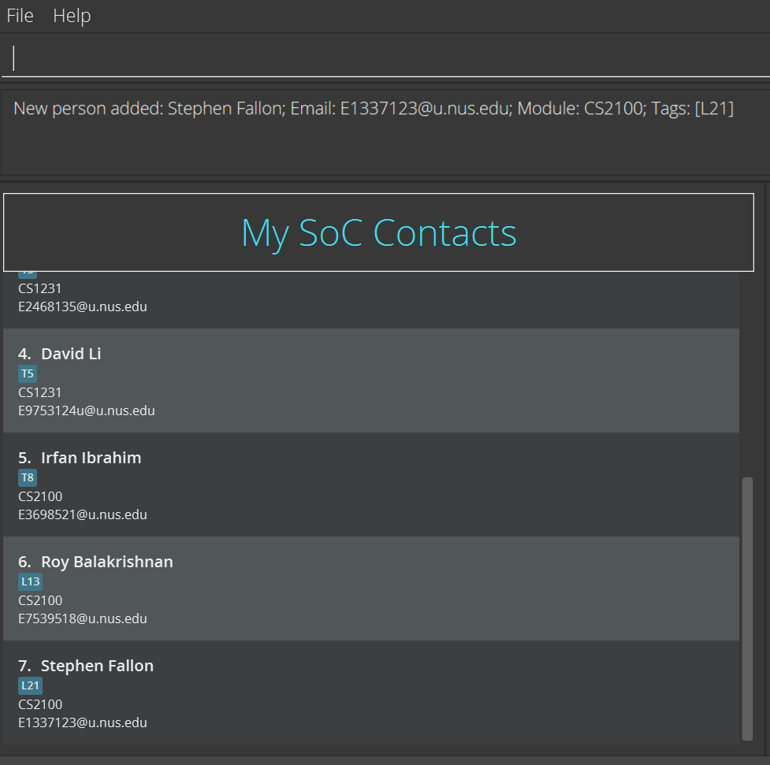 <br /><br />

<div style="page-break-after: always;"></div>

   3. Test case: Repeat `add n/Stephen Fallon m/CS2100 e/E1337123@u.nus.edu t/L21` again <br>
   Expected: No person is added. Error details shown in the status message because the peron, ***Stephen Fallon***, already exists in the list.

2. Adding a person with the same email as a person in the contact list.

   1. Prerequisites: Added ***Stephen Fallon*** in the previous test case. Ensure that there are no persons named ***Ah Beng***. 
   If not, feel free to choose a different name that is not in the contact list.

   2. Test case: `add n/Ah Beng m/CS2100 e/E1337123@u.nus.edu t/L21`<br>
   Expected: No person is added. Error details shown in the status message because the email, ***E1337144@u.nus.edu***, already exists in the list.

3. Adding a person while only ***some*** persons are being shown.

   1. Prerequisites: Ensure there are at least two persons in your contact list. Display a subset of persons using `find n/Stephen Fallon` command 
   assuming Stephen Fallon is one of the persons in the contact list. Feel free to use the `find` command for any other persons in your contact list 
   instead. Check that there are no persons named ***Hawking Einstein*** in your contact list.

   2. Test case: `add n/Hawking Einstein m/CS2100 e/E1337144@u.nus.edu t/L30`<br>
     Expected: ***Hawking Einstein*** contact information is appended to your SoC contact list. Details of the added contact will be shown in the 
   status message. The SoC contact list will display **all** your contacts with ***Hawking Einstein*** appended to your contact list.

4. Adding a person with ***missing*** compulsory fields.

      1. Prerequisites: Ensure that no person in your contact list has the name ***Steve Jobs***.

      2. Some invalid formats of `add` command you can try are `add`, `add m/cs2100 n/Steve Jobs` and `add n/Steve Jobs`. <br/>
      Expected: No person is added. Error details shown in the status message due to invalid command format.

<div style="page-break-after: always;"></div>

### Finding a person

1. Finding a person while ***all*** people are being shown <br>

   1. Prerequisites: List all persons using the `list` command. Multiple people in the list with at least one person 
   named ***Alice***, one person taking the module ***CS2103T*** and one person having the tag ***Lab15***. <br>

   2. Test case: `find n/Alice`<br>
      Expected: Finds all people with the name ***Alice***. <br> Even if ***Alice*** is a first name or last name, the 
   person will be found and their name and details are shown.

   3. Test case: `find m/CS2103T`<br>
      Expected: Finds all people taking the module ***CS2103T***. People found will have their names and details displayed. <br>

   4. Test case: `find t/Lab15`
      Expected: Finds all people with the tag ***Lab15***. People found will have their names and details displayed. <br>

   5. Test case: `find n/Alice m/CS2103T` <br>
      Expected: Finds all people with the name ***Alice*** or module ***CS2103T***. People found will have their names 
   and details displayed. <br><br>

2. Finding a person while only ***some people*** OR ***none*** are being shown

   1. Prerequisites: Empty the display list by calling `find n/`. This returns an empty list as 0 people will be found. 
   Ensure multiple people in the original list with at least one person named **Alice**, one person taking the module 
   **CS2103T** and one person having the tag **Lab15**. <br>
   
   2. Test case: `find t/Lab15`
      Expected: Finds all people with the tag ***Lab15***. Contact List will change from empty and people found will have their names and details displayed. <br>
   
   3. Test case: `find t/Lab15 m/CS2103T` <br>
      Expected: Finds all people with the tag ***Lab15*** or module ***CS2103T***. Contact List will change from empty and people found will have their names
      and details displayed. <br>
   
   4. Test case: `find n/Alice t/Lab15 m/CS2103T` <br>
         Expected: Finds all people with the name ***Alice***, tag ***Lab15***, or module ***CS2103T***. Contact List will change from empty and people found will have their names
         and details displayed. <br><br>
   
3. Finding a person ***without*** specifying the prefix inputs. <br>

   1. Prerequisites: List all persons using the `list` command. Multiple people in the list with at least one person
      named ***Alice***, one person taking the module ***CS2103T*** and one person having the tag ***Lab15***. <br>

   2. Test case: `find t/`
      Expected: Returns an empty list with panel showing "0 persons listed". <br>
   
   3. Test case: `find n/`
         Expected: Returns an empty list with panel showing "0 persons listed". <br>
   
   4. Test case: `find n/ m/`
         Expected: Returns an empty list with panel showing "0 persons listed". <br>
   
   5. Test case: `find n/ m/ t/`
         Expected: Returns an empty list with panel showing "0 persons listed". <br>
   
4. Finding a person with the ***wrong*** module input. <br>

   1. Prerequisites: List all persons using the `list` command. Multiple people in the list with at least 
   one person taking the module **CS2103T**. <br>

   2. Test case: `find m/CSSS2103T`
      Expected: Error details shown in the status message since the module prefix format is invalid.
   
   3. Test case: `find m/CS210345T`
      Expected: Error details shown in the status message since the module prefix format is invalid.
   
   4. Test case: `find m/CS2103TIT`
      Expected: Error details shown in the status message since the module prefix format is invalid.

5. Incorrect `find` command usage. <br>

   1. Test case: `find`
      Expected: Error details shown in the status message since the command format is invalid.
   
   2. Test case: `find e/e12345`
      Expected: Error details shown in the status message since the command format is invalid.
   
   3. Test case: `find Alice`
      Expected: Error details shown in the status message since the command format is invalid.
      
<div style="page-break-after: always;"></div>

### Listing all Persons

1. Listing ***all*** persons when ***some*** persons are displayed.

    1. Prerequisites: Have multiple persons in contact list. Choose one of the person's name and use the `find` command to narrow the search to that person, e.g. `find n/Alex Yeoh` if "Alex Yeoh" is in your contact list.

    2. Test case: `list` <br/>
     Expected: All persons will be shown in contact list. If you have any assignments displayed under Assignments, they will be cleared. Success message shown in the status message.

<div style="page-break-after: always;"></div>

### Deleting a person

1. Deleting a person while ***all*** persons are being shown.

  1. Prerequisites: List all persons using the `list` command. Multiple persons in the list.

  2. Test case: `delete 1`<br>
     Expected: First contact is deleted from the list. Details of the deleted contact shown in the status message.

  3. Test case: `delete 0`<br>
     Expected: No person is deleted. Error details shown in the status message because index has to be a positive integer.

  4. Test case: `delete x` (where x is larger than the list size) <br>
     Expected: No person is deleted. Error details shown in the status message because the index is invalid.

2. Deleting a person while only ***some*** persons are being shown.

  1. Prerequisites: List all persons using the `list` command. Multiple persons in the list. Select one person and search
     the name using the find command, e.g. `find n/Alex Yeoh`.

  2. Test case: `delete 1`<br>
     Expected: First contact is deleted from the list. Details of the deleted contact shown in the status message.

  3. Test case: `delete 0`<br>
     Expected: No person is deleted. Error details shown in the status message because index has to be a positive integer.

  4. Test case: `delete x` (where x is larger than the list size) <br>
     Expected: No person is deleted. Error details shown in the status message because the index is invalid.

3. Deleting a person ***without*** specifying person's index parameter.

  1. Other incorrect delete commands to try: `delete` <br>
     Expected: Error details shown in the status message since the command format is invalid.
     
<div style="page-break-after: always;"></div>

### Editing a person

1. Editing a person while ***all*** persons are being shown.

    1. Prerequisites: There are multiple persons in the contact list (no person called ***Alex*** and no email named ***15434@163.com***).

    2. Test case: `edit 1 n/Alex e/15434@163.com m/CS2100`<br>
     Expected: The first person in the contact list is renamed as ***Alex***, and the email and module of this person changed accordingly to the given.
     Details of the edited person will be shown in the status message.

    3. Test case: `edit 2 n/Alex e/11465434@163.com m/CS2100` just after last test case.<br>
     Expected: No person is edited. Error details shown in the status message since the repeated name is not allowed.

    4. Test case: `edit 2 n/Alex Yeoh e/15434@163.com m/CS2100` just after last test case.<br>
     Expected: No person is edited. Error details shown in the status message since the repeated email is not allowed.

    5. Test case: `edit 2 t/friend t/lab7`<br>
     Expected: The second person's tag is replaced with tags called ***friend*** and ***lab7***.

2. Editing a person while ***no*** person is in the contact list.

    1. Test case: `edit 1 n/Halo` or `edit 1 m/cs1111s` or any other combinations of optional fields.<br>
     Expected: No person is edited. Error details shown in the status message since the index is invalid.

3. Editing a person while ***missing*** compulsory fields.

    1. Test case: You can try `edit` or `edit 1`<br>
     Expected: No person is edited. Error details shown in the status message since the format is invalid.

<div style="page-break-after: always;"></div>

### Showing an assignment list

1. Showing assignments while there are ***multiple*** people in the contact list.

    1. Prerequisites: The current assignment list panel is empty.

    2. Test case: `show 0`<br>
     Expected: No assignments shown in assignment list panel. Error details shown in the status message since the index is invalid.

    3. Test case: `show 1`<br>
     Expected: The assignments of the first person in contact list are shown in assignment list panel.

    4. Test case: `show x` (x is any positive number greater than the number of people in the contact list.)<br>
     Expected: No assignments shown in assignment list panel. Error details shown in the status message since the index is invalid.

2. Showing assignments while there is ***no person*** in the contact list.

    1. Prerequisites: The current assignment list panel is empty.

    2. Test case: `show 1`<br>
     Expected: No assignments shown in assignment list panel. Error details shown in the status message since the index is invalid.

3. Showing assignments while ***missing*** compulsory fields.

    1. Prerequisites: The current assignment list panel is empty.

    2. Test case: `show`<br>
     Expected: No assignments shown in assignment list panel. Error details shown in the status message since the format is invalid.

<div style="page-break-after: always;"></div>

### Giving an assignment

1. Giving an assignment while ***all*** assignments of a person are being shown.

   1. Prerequisites: There are multiple persons in the contact list and the first person's assignments are shown already.

   2. Test case: `give 1 d/lab2 by/11/11/2021`<br>
      Expected: ***lab2*** assignment is appended to the first person's assignment list. Details of the added assignment will be
      shown in the status message. The assignment list panel will display **pending and completed** assignments sorted by
      due date with all pending assignments above completed ones.

   3. Test case: Repeat `give 1 d/lab2 by/11/11/2021` again.<br>
      Expected: No assignment is added into the assignment list panel. Error details shown in the status message since no repeated assignments are allowed.

   4. Test case: `give 2 d/lab2 by/20/12/2021`<br>
      Expected: ***lab2*** assignment is appended to second person's assignment list. Details of the added assignment will be
      shown in the status message. The assignment list panel will display **second** person's **pending and completed**
      assignments sorted by due date with all pending assignments above completed ones.

2. Giving an assignment while assignment list panel is ***empty***.

    1. Prerequisites: There are multiple persons in the contact list.

    2. Test case: `give 1 d/lab3 by/11/11/2021`<br>
       Expected: ***lab3*** assignment is appended to the first person's assignment list. Details of the added assignment will be
       shown in the status message. The assignment list panel will display the **first** person's **pending and completed** assignments
       sorted by due date with all pending assignments above completed ones.

    3. Test case: `give x d/lab3 by/11/11/2021` (where x is a number larger than the number of people in the contact list)<br>
       Expected: No assignment is added into the assignment list panel. Error details shown in the status message since the index is invalid.

3. Giving an assignment while ***missing*** compulsory fields.

    1.Test case: you can try `give`, `give d/lab3`, `give by/11/11/2021` and so on.<br>
      Expected: No assignment is added into the assignment list panel. Error details shown in the status message since the format is invalid.

<div style="page-break-after: always;"></div>

### Giving an assignment to all persons in a module

1. Giving a new assignment to ***all*** persons in a module

    1. Prerequisites: Have multiple persons in the same module. Filter out the persons in this module, e.g. If these persons
     are under the module ***CS2100***, execute `find m/CS2100` to see all persons in the module ***CS2100***. Ensure that none of these
     persons have the assignment you wish to give using the `show` command.

    2. Test case: `giveall m/CS2100 d/Assignment 3 by/ 11/11/2021` <br>
     Expected: All persons in the module "CS2100" have "Assignment 3" with due date "11/10/2021" added into their assignment list.
     Execute `show INDEX` command to check that all persons have this assignment in their assignment list. If you started with the 6 persons
     from the sample data and have executed the series of commands described above, you should be able to see the result of the
     command illustrated in the image below. Note that the image is displaying the assignment list of "Alex Yeoh" as `show 1` was executed.
     <br>
       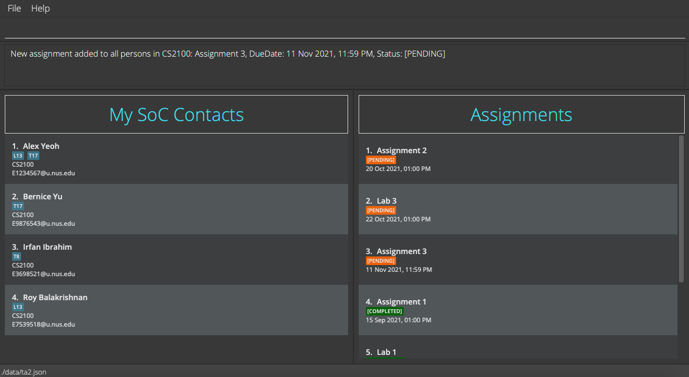
     <br>

    3. Test case: Repeat `giveall m/CS2100 d/Assignment 3 by/ 11/11/2021` <br>
     Expected: No duplicated assignment should be added for all persons the module ***CS2100***. Error message will be shown
     as all persons already have the specified assignment. The assignment list of persons should show the same assignments
     as the one in the previous test case.

   <div style="page-break-after: always;"></div>

2. Giving an assignment to ***some*** persons without the assignment.

    1. Prerequisites: Start with the sample data and filter out the persons in the module ***CS2100*** by executing `find m/CS2100`.
     The person ***Roy Balakrishnan*** will not have ***Assignment 1***, while other persons in ***CS2100*** will have this assignment.
     Execute `show 1` to see the details of ***Assignment 1*** in the first person's assignment list.

    2. Test case: `giveall m/CS2100 d/Assignment 1 by/ 11/11/2021, 1300` <br>
     Expected: The specified assignment should not be added to ***Roy Balakrishnan***. Error message will be shown as the specified
     assignment has a due date of ***11/11/2021, 1300***, but the due date of ***Alex Yeoh*** 's assignment is ***15/09/2021, 1300***.

    3. Test case: `giveall m/CS2100 d/Assignment 1 by/ 15/09/2021, 0900` <br>
     Expected: The specified assignment should not be added to ***Roy Balakrishnan***. Error message will be shown as the specified
     assignment has a due date of ***15/09/2021, 1300***, but the due date of ***Alex Yeoh*** 's assignment is ***15/09/2021, 0900***.

    4. Test case: `giveall m/CS2100 d/assignment 1 by/ 15/09/2021, 1300` <br>
     Expected: The assignment ***Assignment 1*** with due date ***15/09/2021, 1300*** should be added to ***Roy Balakrishnan***. Note that
     the letter ***a*** is capitalised as other persons' assignment is ***Assignment 1*** with a capitalised ***a***.

<div style="page-break-after: always;"></div>

### Marking an assignment

1. Marking an assignment while ***all*** assignments of a person are being shown.

    1. Prerequisites: There are multiple persons in the contact list and the first person's assignments (at least one assignment) are already shown.

    2. Test case: `done 1`<br>
     Expected: The first assignment is marked as done in assignment list panel. Details of the marked assignment will be
     shown in the status message. The assignment list panel will display **pending and completed** assignments sorted by
     due date with all pending assignments above completed ones.

    3. Test case: `done x` (where x is a number larger than the number of assignments in the assignment list)<br>
     Expected: No assignment is marked. Error details shown in the status message since the index is invalid.

    4. Test case: `done 0`<br>
     Expected: No assignment is marked. Error details shown in the status message since the index is invalid.

2. Marking an assignment while assignment list panel is ***empty***.

    1. Prerequisites: There are multiple persons in the contact list and no person's assignment list is shown.

    2. Test case: `done 1`<br>
     Expected: No assignment is marked. Error details shown in the status message since the index is invalid.

3. Marking an assignment while ***missing*** compulsory fields.

    1. Test case:`done`<br>
     Expected: No assignment is marked as completed in the assignment list panel. Error details shown in the status message since the format is invalid.

<div style="page-break-after: always;"></div>

### Removing an assignment

1. Removing an assignment while ***all*** assignments of a person are being shown.

   1. Prerequisites: There are multiple persons in the contact list and the first person's assignments (at least one assignment) are shown already.

   2. Test case: `remove 1`<br>
      Expected: The first assignment is removed in assignment list panel. Details of the removed assignment will be
      shown in the status message. The assignment list panel will display **pending and completed** assignments sorted by
      due date with all pending assignments above completed ones.

   3. Test case: `remove x` (where x is a number larger than the number of assignments in the assignment list)<br>
      Expected: No assignment is removed. Error details shown in the status message since the index is invalid.

   4. Test case: `remove 0`<br>
      Expected: No assignment is removed. Error details shown in the status message since the index is invalid.

2. Removing an assignment while assignment list panel is ***empty***.

   1. Prerequisites: There are multiple persons in the contact list and no person's assignment list is shown.

   2. Test case: `remove 1`<br>
      Expected: No assignment is removed. Error details shown in the status message since the index is invalid.

3. Removing an assignment while ***missing*** compulsory fields.

   1. Test case:`remove`<br>
      Expected: No assignment is removed from the assignment list panel. Error details shown in the status message since the format is invalid.


<div style="page-break-after: always;"></div>

### Cleaning all completed assignments

1. Prerequisites: Have a mix of completed and pending assignments for several persons. Execute `list` to see the list
   of all persons.

2. Test case: `clean` <br>
   Expected: All completed assignments are removed for all persons. The result of the command is shown in the image below.
   Note that the assignment panel is showing the assignment list of the first person as `show 1` was executed before `clean`.
   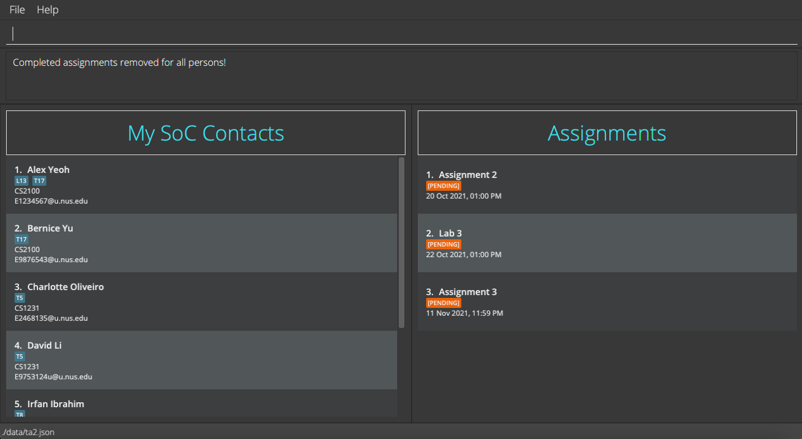 <br>

<div style="page-break-after: always;"></div>

### Clearing all entries

1. Prerequisites: Have ***multiple*** persons in your list.

2. Type `show 1` to display the first person's assignment list.

3. Test case: `clear`<br/>
   Expected: All contacts will be deleted from the list. Assignment list panel will be cleared. Success message shown in the status message.

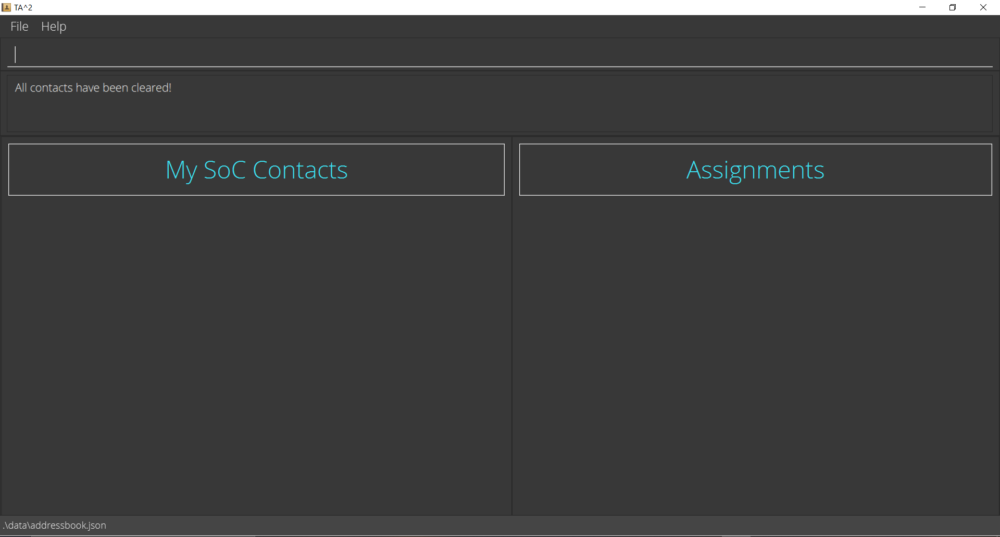

<div style="page-break-after: always;"></div>

### Undoing a command

1. Undoing a command at the ***start*** of program.

   1. Test case: `undo`<br>
      Expected: Nothing is undone. Error details shown in the status message since no state can be undone.

2. Undoing a command ***after*** entering some commands.

   1. Test case: `undo`<br>
      Expected: Retrieves the effect before conducting the last command (except `undo`).
      
###  Redoing a command

1. Redoing a command at the ***start*** of program.

   1. Test case: `redo`<br>
      Expected: Nothing is redone. Error details shown in the status message since no state can be redone.

2. Redoing a command ***after*** a `undo` command.

   1. Test case: `redo`<br>
      Expected: Recovers the effect of last `undo` command.

3. Redoing a command after a command ***except*** `undo`.

   1. Test case: `redo`<br>
      Expected: Nothing is redone. Error details shown in the status message since no state can be redone.

### Exiting the Program

1. Test case: `exit` <br/>
   Expected: The **TA<sup>2</sup>** window will close promptly.
   
<div style="page-break-after: always;"></div>

### Saving data

1. Data file `ta2.json` is ***missing***. <br>

   1. Prerequisites: To simulate, delete `ta2.json` file. <br>
   
   2. Expected: **TA<sup>2</sup>** will start with sample data. <br>
   
2. Data file `ta2.json` in ***wrong format***. <br>

   1. Prerequisites: To simulate, remove a square bracket in the `ta2.json` file. <br>
   
   2. Expected: **TA<sup>2</sup>** will start with no data. <br>
   
   3. Corrective action: 
   
      1. If you wish to start **TA<sup>2</sup>** afresh, just input commands as per normal and the existing
      file will be overridden with the new data that you input. <br>
      
      2. If you wish to retrieve your existing data, do not input any command. <br>
      
           1. Copy the current `ta2.json` file to another location before exiting **TA<sup>2</sup>**.

           2. Look through `ta2.json` and correct any formatting issues.

           3. Copy the corrected `ta2.json` back to the data folder and start the application.

           4. **TA<sup>2</sup>** will display all the data normally if `ta2.json` is in the correct format. If `ta2.json` is still
           in the wrong format, repeat the corrective action.

           5. Refer [here](https://github.com/AY2122S1-CS2103T-T13-2/tp/blob/master/bin/data/sampledata.json) for a sample data file in the correct format.
