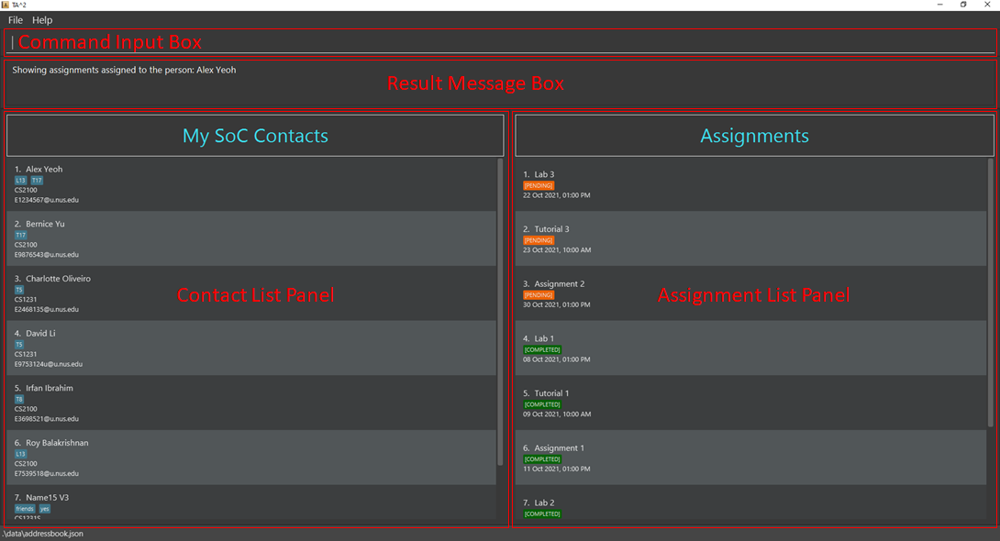
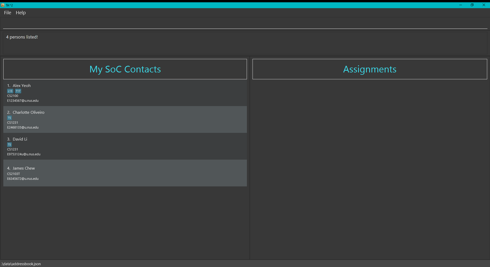
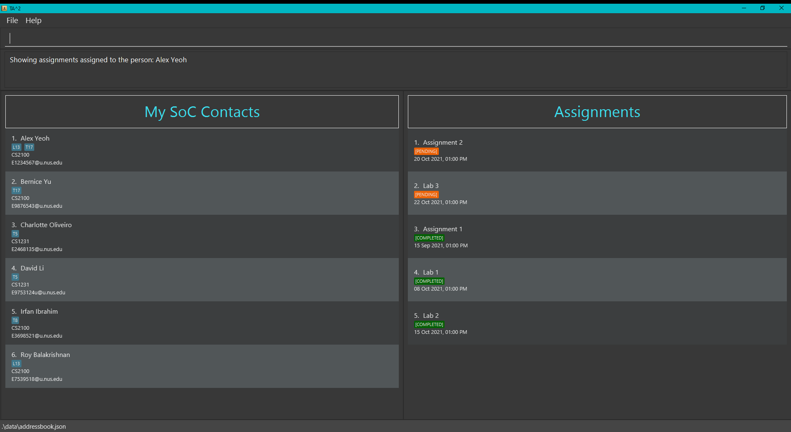

Teaching Assistant's Assistant (TA2) is a **desktop app designed for teaching assistants/tutors/professors
from the School of Computing to help manage student contacts and keep track of students' assignment submissions. TA2 is
optimized for use via a Command Line Interface** (CLI) while still having the benefits of a Graphical User Interface (GUI).
If you can type fast, TA2 can get your contact and assignment management tasks done faster than traditional GUI apps.

* Table of Contents
{:toc}

--------------------------------------------------------------------------------------------------------------------

## Quick start

1. Ensure you have `Java 11` or later installed in your Computer.

2. Download the latest `ta2.jar` release from [here](https://github.com/AY2122S1-CS2103T-T13-2/tp/releases/tag/v1.4).

3. Copy the file to the folder you want to use as the _home folder_ for your TA2.

4. Double-click the file to start the app. The window similar to the one shown below should appear in a few seconds.
   Note how the app contains some sample data. 
   

5. You can try some commands by typing them in the command input box and press Enter to execute it.

   Some example commands you can try:

   * **`list`**: Lists all contacts.

   * **`add`**`n/John Doe m/CS2100 e/e1234567@u.nus.edu`: Adds a student named `John Doe` with his/her relevant information into the contact list.

   * **`giveall`**`d/Assignment 1 m/CS2100 by/31/12/2021`: Adds an assignment call  `Assignment 1`, with deadline 2021, Dec 31,
     to the assignment list of all students in the contact list who are under the module `CS2100`.

6. Once you finished, and you don't want to keep these sample data. Try `clear` command to offer you a tidy and clean window, 
   and the journey of using TA2 officially starts!

   * **`clear`**: Deletes all contacts.

7. Refer to the [Features](#features) below for details of each command.

--------------------------------------------------------------------------------------------------------------------

## UI Mockup

 * Command Input Box: The box to type in your commands.

 * Result Message Box: Displays a success message if your command has been executed, or an error message if your command
   has failed.

 * Contact List: Displays your student's relevant information. (Can be modified using `find`)

 * Assignment List: Displays a specified student's assignments. (Activated using `show`)

--------------------------------------------------------------------------------------------------------------------

## Features

**:information_source: Notes about the command format:** 

* Words in `UPPER_CASE` are the parameters to be supplied by the user. 
  e.g. in `add n/NAME`, `NAME` is a parameter which can be used as `add n/John Doe`.

* Items in square brackets are optional. 
  e.g. `n/NAME [t/TAG]` can be used as `n/John Doe t/friends` or as `n/John Doe`.

* Items with `…`​ after them can be used multiple times including zero times. 
  e.g. `[t/TAG]…​` can be used as ` ` (i.e. 0 times), `t/friends`, `t/Leader t/friends` etc.

* Parameters can be in any order. 
  e.g. if the command specifies `n/NAME e/EMAIL`, `e/EMAIL n/NAME` is also acceptable.

* If a command requires `INDEX` as an input, only one input for `INDEX` is expected. `INDEX` **must** be more than 0 and less than 10,000. 

* If a parameter is expected only once in the command, but you specify it multiple times, only the last occurrence of the parameter will be taken. 
  e.g. if you specify `m/cs2103 m/cs2101`, only `m/cs2101` will be taken.

* Extraneous parameters for commands that do not take in parameters (such as `help`, `list`, `exit` and `clear`) will be ignored. 
  e.g. if the command specifies `help 123`, it will be interpreted as `help`.

### Viewing help: `help`

Shows a help window with a link directing you to the user guide. Alternatively this can be access by clicking the `Help` button
that can be found in the top left corner.

Format: `help`

Possible usage:
* The help window can be useful if you would like to refer to the user guide for more details of the
available features in TA2.

### Adding a student: `add`

Adds a student to the contact list with the student's relevant information.

Format: `add n/NAME e/EMAIL m/MODULE [t/TAG]…​`

**:information_source: Note:** 

* Duplicate `NAME` is **not allowed**.

    * e.g. `add n/Alex Yeoh...` is not allowed if there is already a student named Alex Yeoh in the contact list.

* Extra spaces before and between names will be removed.

* A student's `MODULE` must follow the format as shown [here.](#module-naming-convention)

* Only student's initials and module code will be capitalised on the displayed student list. 

    * e.g. `n/alex yeoh`, `n/DAVID LI` will be converted to `Alex Yeoh` and `David Li` respectively. 

    * e.g. `cs2100`, `GER1000t` will be converted to `CS2100` and `GER1000T` respectively. 

* A student's `EMAIL` must follow the format:

    * The whole `EMAIL` must have a **maximum of 320 characters**.

    * The local part must have a **maximum of 64 characters**.

    * The domain name must have a **maximum of 255 characters**.

* Duplicate `EMAIL` is **not allowed**.

    * e.g. `add e/E1234567@u.nus.edu` is not allowed if there is already a student with the same email.

* `TAG` can only accept alphanumeric characters.

* A student can have any number of `TAG` (including 0). 

Examples:
* `add n/John Doe m/CS1010 e/e1234567@u.nus.edu`
* `add n/Betsy Crowe e/e0234567@u.nus.edu m/CS2103T`
* `add n/alex yeoh e/e1234123@u.nus.edu m/GEQ1000 t/T17`

Possible Usage:

* You can use `add` to add new students into the contact list when you receive new students.

* `TAG` can be used to separate students by their tutorial group or to mark out students that require more attention.

### Finding students with matching input keywords: `find`

Displays the list of people who match any of the input keywords. The matching is based
on an ***OR*** basis, where if a student matches at **least one keyword**, that student will
be considered as matched and thus displayed.

Format: `find [n/NAME] [m/MODULE] [t/TAG]...`

**:information_source: Note:** 

1. There should be at least one prefix.

2. Ordering of prefixes are not strict and presence of multiple keywords are acceptable.

3. Keywords are **case-insensitive**   e.g. `cs1101s` will match `CS1101S`.

4. Each part of name separated by space will be match.  
   e.g. `n/Hans` or `n/Bo` will both match `Hans Bo`.  
   e.g. `n/Sam` will match `Sam Tan` but not `Samuel Lee`.

5. Students' names matching at least one keyword will be returned (i.e. `OR` search).  
   e.g. `n/Hans Bo` will return `Hans Gruber`, `Bo Yang`.

6. Prefixes with empty keywords will not match anyone.  
   e.g. `find n/ m/ t/` will return 0 students

7. Module codes must strictly follow the module naming convention shown [here.](#module-naming-convention)

:bulb: **Tip:**
* We can search for multiple fields.  
  e.g. `m/CS1101S CS2103T` or `m/CS1101S m/CS2103T` will return people who take either modules.

Examples:
* `find n/Bernice` returns the students with name of `Bernice`.
* `find m/CS1101S` returns the students with module `CS1101S`.
* `find t/Lab15` returns the students with the tag `Lab15`.
* `find n/Bernice m/MA1521` returns the students with name of `Bernice` or study module `MA1521`.
* `find m/CM1417 t/Group04` returns the students with module `CM1417` or with the tag `Group04`.
* `find n/Evian m/CS2103T t/Group10` returns the students who at least satisfy one of the requirements: with the name `Evian`, study module`CS2103T` or with the tag `Group10`.
* `find t/E34 n/Brian m/GEQ1000` returns the students who at least satisfy one of the requirements: with the name `Brian`, study module`GEQ1000` or with the tag `E34`.
* `find n/alex david m/cs1231 cs2103t` returns the students who at least satisfy one of the requirements:
  containing `david` or `alex` as separated parts of their names, study module`cs1231` or `cs2103t` (Shown in the image below).

Possible Usage:

* You can use `find` to help you find a specific student.

* You can use `find`  to help you filter the list to show only students of a specific:

    * `MODULE` if you are teaching multiple modules.

    * `TAG` if you use it to separate students by tutorial groups.

### Listing all students: `list`

Shows a list of all students in the contact list.

Format: `list`

Possible Usage:

* After using `find` to filter the list, you can use `list` to reset the contact list to show all students.

### Deleting a student: `delete`

Deletes the specified student from the contact list.

Format: `delete INDEX`

* Deletes the student and its relevant information from the contact list at the specified `INDEX`.

Examples:
* `list` followed by `delete 2` deletes the second student in the contact list. (if 2nd student exists).
* `find n/Betsy` followed by `delete 1` deletes the first student in the resulted contact list after `find` command. (if the result is not empty)

Possible usage:

*  You can use `delete` to delete any student and its relevant information that you do not want to keep.

### Editing a student: `edit`

Modifies any part of the student's information.

Format: `edit INDEX [m/MODULE] [e/EMAIL] [t/TAG] [n/NAME]…​`

**:information_source: Note:** 

* The index refers to the index number shown in the displayed contact list.

* The index **must be a positive integer within the number of students in the displayed contact list** 1, 2, 3, ...(till the index of the last student)​

* If you have two identical prefixes with the edit command, only the last prefix will be used for the edit. (except for prefix t/)

* Require **at least one** prefix to edit.

:bulb: **Tip:**

* You can modify several parts of student information at the same time.

* If you wish to remove the tags for a student, simply type `t/` prefix without any parameters.

Examples:

* `edit 2 e/e0001111@u.nus.edu` replaces the second student's email in the displayed contact list with `e0001111@u.nus.edu`.

* `edit 1 n/Brob` changes first student's name in the displayed contact list to `Brob`.

* `edit 1 n/Brob n/New m/cs1101 m/cs1231s` changes first student's name in the displayed contact list to `New` and module to `cs1231s`.

Possible Usage:

* You can use `edit` to make any changes to a student's relevant information after you has mistyped any.

### Showing a student’s assignments: `show`

Shows the assignments of the specified student in the assignment list.
The assignment list is always sorted by status and date.

Format: `show INDEX`

* Shows the assignment list of the student at the specified `INDEX` of the displayed contact list.

**:information_source: Note:** 

* Assignments with `COMPLETED` status will be at the bottom of the list. 

* Assignments with `PENDING` status will be at the top of the list. 

* Assignments with the same status will be sorted by due date. 

Examples:

* The index refers to the index shown in the displayed student list.

* `show 1` renders the first student’s assignment list on the assignment list panel (Shown in the image below).
  

Possible Usage:

* You can use `show` to display the assignments of the student you would like to see and make modifications to.

### Giving assignments: `give` `giveall`

#### Giving an assignment to a student: `give`

Gives an assignment with a deadline to the student specified by the index in the contact list.

Format: `give INDEX d/DESCRIPTION by/ d/M/yyyy [,HHmm]`

:bulb: **Tip:**

* You can give assignments with due dates that has passed the current date of use.

* The date `d/M/yyyy` can be replaced by [friendly commands](#friendly-commands).

* If time `[,HHmm]` is not specified, time will be set to `11:59 pm` by default.

**Note:**
1. It is possible to add an assignment using `giveall` even if some students have the assignment already. Students who have the
assignment will not receive a duplicate assignment.
2. When using `giveall` in the situation stated in point 1, the specified assignment in the input needs to have the same
due date as the existing assignment. **The command will not be valid if the due date is different.** This is to ensure
consistency of the due dates of the same assignment.

Examples:

* `give 1 d/Lab 1 by/21/8/2021` gives the first student displayed in your contact list an assignment of description `Lab1` with a deadline `21 Aug 2021, 11:59pm`.

* `give 2 d/Assignment 2 by/ 2/9/2021,1200` gives the second student displayed in your contact list an assignment of description `Assignment 2` with a deadline `22 Sep 2021, 12:00pm`.

* If the current date is `1 Nov 2021` and it is a monday

    * `give 1 d/Tutorial 3 by/mon` gives the first student displayed in your contact list an assignment of description `Tutorial 3` with a deadline `8 Nov 2021, 11:59pm`.

    * `give 2 d/Report 1 by/tue, 1800` gives the second student in your contact list an assignment of description `Report 1` with a deadline `2 Nov 2021, 11:59pm`.

Possible Usage:

* You can use `give` when there is an assignment that you want to give to selected students only.

#### Giving an assignment to all students in a module: `giveall`

Adds an assignment with a deadline to all students in the specified module .

Format: `giveall m/MODULE d/DESCRIPTION by/ d/M/yyyy [,HHmm]`

:bulb: **Tip:**

* You can give assignments with due dates that has passed the current date of use.

* The date `d/M/yyyy` can be replaced by [friendly commands](#friendly-commands).

* If time `[,HHmm]` is not specified, time will be set to `11:59 pm` by default.

Examples:

* `giveall m/CS2100 d/Assignment 2 by/ 15/10/2021,1300` gives all students of module CS2100 an assignment of description `Assignment 2` with a deadline `15 Oct 2021, 01:00pm`.

* `giveall m/CS2103T d/iP by/ 02/09/2021` gives all students of module CS2103T an assignment of description `iP` with a deadline `2 Sep 2021, 11:59pm`.

* `giveall m/CS2100 d/Assignment 2 by/ 15/10/2021,1300` is an invalid input if some students of module CS2100 has the assignment
  of description `Assignment 2` with a deadline `15 Oct 2021, 01:00pm`.
Possible Usage:

*  You can use `giveall` instead of `give` when there is a module assignment, whereby all students under the module is required to submit.

### Marking an assignment of a student: `done`

Marks a specified assignment's deadline of a student as completed.

Format: `done INDEX`

* Marks the assignment at the specified`INDEX` as completed in the displayed assignment list of a student.

**:information_source: Note:** 

* Assignments with pending status will have an orange tag.

* Assignments with completed status will have a green tag.

* Remember to display the student's assignment list using [show](#showing-a-students-assignment-list-show) before using the done command!

Examples:

* `done 3` marks the 3rd assignment in the displayed assignment list as completed.

Possible Usage:

* You can use `done` to mark assignments that has been submitted, so you can keep track which student has not submitted yet.

### Removing an assignment of a student: `remove`

Removes the specified assignment from a student.

Format: `remove INDEX`

* Removes the assignment at the specified`INDEX` in the displayed assignment list of a student.

Examples:

* `remove 10` deletes the 10th assignment in the displayed assignment list of a student.

**:information_source: Note:** 

Remember to display the student's assignment list using [show](#showing-a-students-assignment-list-show) before using the `remove` command!

Possible Usage:

* You can use `remove` when you have added an assignment to the wrong student.

### Removing completed assignments from all students: `clean`

Removes all completed assignments from all students in TA2.

Format: `clean`

Possible Usage:

* You can use `clean` to help remove all completed assignments to reduce clutter in the assignment list.

### Clearing all entries: `clear`

Clears all entries from TA2.

Format: `clear`

Possible Usage:

* You can use `clear` to remove and reset all data from TA2 when you deem all the old data unnecessary.

### Undoing a command: `undo`

Undoes the last command entered.

Format: `undo`

:exclamation:**Caution:**

* Undo all commands except for `undo` and `redo`.
* At the start of the program, you can not undo anything.

### Redoing a command: `redo`

Recovers the effect of the last `undo` command.

Format: `redo`

:exclamation:**Caution:**

* Redo all commands except for `undo` and `redo`.
* Once you enter a new command except for `undo` and `redo`, you can not redo anymore.

### Exiting the program: `exit`

Exits the program.

Format: `exit`

### Saving the data

TA2 data are saved in the hard disk automatically after any command that changes the data. There is no need to save manually.

### Editing the data file

TA2 data are saved as a JSON file `[JAR file location]/data/ta2.json`. Advanced users are welcome to update data directly by editing that data file.

:exclamation:**Caution:**

* If your changes to the data file make its format invalid, TA2 will discard all data and start with an empty data file at the next run.

--------------------------------------------------------------------------------------------------------------------

## FAQ

**Q**: How do I transfer my data to another Computer? 
**A**: Install the app in the other computer and overwrite the empty data file it creates with the file that contains the data of your previous TA2 home folder.

--------------------------------------------------------------------------------------------------------------------

## Command summary

Action | Command | Format | Examples
------------|--------|-----------|-------
[Viewing help](#viewing-help-help) | **help** | `help`
[Adding a student](#adding-a-student-add) | **add** | `add` `n/NAME e/EMAIL m/MODULE [t/TAG]…​` | `add n/James Ho m/CS2100 e/E7954753@u.nus.edu t/T25`
[Finding students with matching input keywords](#finding-students-with-matching-input-keywords-find) | **find** | `find` `[n/NAME] [m/MODULE] [t/TAG]…​` | `find n/James Jake m/CS2100 t/T13`
[Listing all students](#listing-all-students-list) | **list** | `list`
[Deleting a student](#deleting-a-student-delete) | **delete** | `delete` `INDEX` | `delete 3`
[Editing a student](#editing-a-student-edit) | **edit** | `edit` `INDEX [n/NAME] [m/MODULE] [e/EMAIL] [t/TAG]…​` | `edit 2 n/James Lee e/E4853765@u.nus.edu`
[Showing a student's assignments](#showing-a-students-assignments-show) | **show** | `show` `INDEX` | `show 2`
[Giving an assignment to a student](#giving-an-assignment-to-a-student-give) | **give** | `give` `INDEX d/DESCRIPTION by/ d/M/yyyy [,HHmm]` | `give 1 d/Lab1 by/ 21/8/2021,1600`
[Giving an assignment to all students in a module](#giving-an-assignment-to-all-students-in-a-module-giveall) | **giveall** | `giveall` `m/MODULE d/DESCRIPTION by/ d/M/yyyy [,HHmm]` | `giveall m/CS2100 d/Lab1 by/ 21/8/2021`
[Marking an assignment of a student](#marking-an-assignment-of-a-student-done) | **done** | `done` `INDEX` | `done 4`
[Removing assignment of a student](#removing-an-assignment-of-a-student-remove) | **remove** | `remove` `INDEX` | `remove 10`
[Removing completed assignments from all students](#removing-completed-assignments-from-all-students-clean) | **clean** | `clean`
[Clearing all entries](#clearing-all-entries-clear) | **clear** | `clear`
[Undoing a command](#undoing-a-command-undo) | **undo** | `undo`
[Redoing a command](#redoing-a-command-redo) | **redo** | `redo`
[Exiting the program](#exiting-the-program-exit) | **exit** | `exit`

--------------------------------------------------------------------------------------------------------------------
## Glossary

#### Friendly commands

* `today` - sets due date to tonight.

* `tmr` - sets due date to tomorrow.

* `week` - sets due date to a week(7 days) from now.

* `mon` - sets due date to the coming monday.

* `tue` - sets due date to the coming tuesday.

* `wed` - sets due date to the coming wednesday.

* `thu` - sets due date to the coming thursday.

* `fri` - sets due date to the coming friday.

* `sat` - sets due date to the coming saturday.

* `sun` - sets due date to the coming sunday.

#### Module Naming Convention

- The module format is **XX[X]1111[X]**, where X is any letter, 1 is any number and values in square brackets are optional. 

--------------------------------------------------------------------------------------------------------------------
