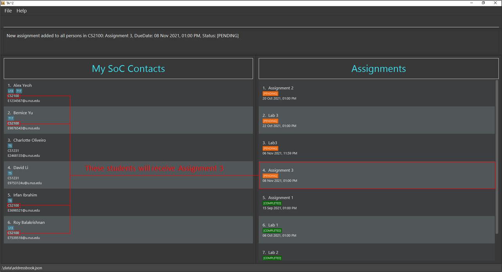

--------------------------------------------------------------------------------------------------------------------

## **Welcome to TA2's User Guide!**
{:.no_toc}

**Teaching Assistant's Assistant (TA2)** is a desktop app that offers a convenient way for teaching assistants
from the School of Computing at the National University of Singapore to manage student contacts and keep track of students' assignment submissions.

**TA2** is optimized for use via a **Command Line Interface (CLI)** while still having the benefits of a Graphical User Interface (GUI). If you can type fast, **TA2** can get your contact and assignment management tasks done faster than traditional GUI apps!

This user guide provides you with installation instructions, guide on features of **TA2** and some FAQs.

Through this guide, you may encounter the following icons.

* **:exclamation: Caution:** Warns you about potential unintended or undesirable behaviours.  
* **:information_source: Notes:** Provides information that you are required to know.  
* **:bulb: Tip:** Provides additional information that are good to know.  

If you are a new user, check out the [Quick start](#quick-start) section to help you get started with **TA2**.

For advanced users, the [Command summary](#command-summary) section gives you an overview of all the commands **TA2** offers.

*Last Updated: 8 November 2021*

--------------------------------------------------------------------------------------------------------------------

## Table of Contents
{:.no_toc}

* Table of Contents
{:toc}

--------------------------------------------------------------------------------------------------------------------

## Quick start

1. Ensure you have `Java 11` or later installed in your Computer.

2. Download the latest `ta2.jar` file from [here](https://github.com/AY2122S1-CS2103T-T13-2/tp/releases/tag/v1.4).

3. Copy the file to the folder you want to use as the _home folder_ for **TA2**.

4. Double-click the file to start the app. The window similar to the one shown below should appear in a few seconds.
   Note how the app contains some sample data.
     
   
     
5. You can warm up with some commands by typing them in the command input box and pressing Enter to execute it.

   Some example commands you can try:

    * **`list`**: Lists all of your contacts.

    * **`add`**`n/John Doe m/CS2100 e/e1234567@u.nus.edu`: Adds a student named `John Doe` into your contact list.

    * **`show`**`1`: Displays the assignments of the first student in your assignment list.
    
    * **`give`**`d/Assignment 1 by/27/3/2022`: Gives an assignment, `Assignment 1` that is due by 27 Mar 2022 at  11.59pm, to the first student in your contact list.

   

6. Refer to the [Features](#features) below for more details of each command.

**:bulb: Tip:**
 
* If you are unsure about where the contact list, assignment list or command input box are, check out the [Ui Design](#ui-design) section.

--------------------------------------------------------------------------------------------------------------------

## UI Design

 
 * **Command Input Box**: Type your commands here!

 * **Result Message Box**: Displays the details of the result of your commands.
   
 * **Contact List**: Displays your list of students and their relevant information.
   
 * **Assignment List**: Displays a specified student's assignments.

--------------------------------------------------------------------------------------------------------------------

## Features

**:information_source: Notes about the command format:** 

* Words in `UPPER_CASE` are the parameters to be supplied by the user. 
   
  * e.g. in `add n/NAME`, `NAME` is a parameter which can be used as `add n/John Doe`.  

* Items in square brackets are optional. 
   
  * e.g. `n/NAME [t/TAG]` can be used as `n/John Doe t/T17` or as `n/John Doe`  

* Items with `…`​ after them can be used multiple times including zero times. 
   
  * e.g. `[t/TAG]…​` can be used as ` ` (i.e. 0 times), `t/T17`, `t/T17 t/Group1` etc.  

* Parameters can be in any order. 
   
  * e.g. if the command specifies `n/NAME e/EMAIL`, `e/EMAIL n/NAME` is also acceptable.  

* If a command requires `INDEX` as an input, only one input for `INDEX` is expected. `INDEX` **must** be an integer from 1 to 10,000.  

* If a parameter is expected only once in the command, but you specify it multiple times, only the last occurrence of the parameter will be taken,
unless otherwise mentioned in the command description.  
   
  * e.g. if you specify `m/cs2103 m/cs2101`, only `m/cs2101` will be taken.  

* Extraneous parameters for commands that do not take in parameters (such as `help`, `list`, `exit` and `clear`) will be ignored. 
   
  * e.g. if the command specifies `help 123`, it will be interpreted as `help`.

### Viewing help: `help`

Shows a help window with a link directing you to this user guide. 

Alternatively, you can click the `Help` button in the top left corner or press `F1` on your keyboard to open up the help window (Shown in the image below).
  

Format: `help`

Possible usage: 
* The help window will direct you back to this user guide from **TA2** if you need details of any available features.

### Adding a student: `add`

Adds a student to your contact list with their relevant information.

Format: `add n/NAME e/EMAIL m/MODULE [t/TAG]…​`

**:information_source: Note:** 

* Duplicate `NAME` is **not allowed**.
  
   * e.g. `add n/Alex Yeoh...` is not allowed if there is already a student named Alex Yeoh in your contact list.  

* Extra spaces before, after, and between names will be removed.

* A student's `MODULE` must follow the format as shown [here](#module-naming-convention).

* Only student's initials and module code will be capitalised on the displayed student list. 

    * e.g. `n/alex yeoh`, `n/DAVID LI` will be converted to `Alex Yeoh` and `David Li` respectively. 

    * e.g. `cs2100`, `GER1000t` will be converted to `CS2100` and `GER1000T` respectively.  

 * A student's `EMAIL` must follow the format as shown [here](#email-format).

* Duplicate `EMAIL` is **not allowed**.

    * e.g. `add e/E1234567@u.nus.edu` is not allowed if there is already a student with the same email.  

* `TAG` can only accept alphanumeric characters with no spaces in between.

* A student can have any number of `TAG` (including 0). 

Examples:
* `add n/John Doe m/CS1010 e/e1234567@u.nus.edu`

* `add n/Betsy Crowe e/e0234567@u.nus.edu m/CS2103T`

* `add n/alex yeoh e/e1234123@u.nus.edu m/GEQ1000 t/T17`

Possible Usage:

* You can use `add` to add new students into the contact list when you receive new students.

* `TAG` can be used to separate students by their tutorial group or to mark out students that require more attention.

### Finding students with matching input keywords: `find`

Filters and displays your contacts who match **at least one** of the input keywords.

Format: `find [n/NAME]…​ [m/MODULE]…​ [t/TAG]…​`

**:information_source: Note:** 

* There should be **at least one** prefix.

* Ordering of prefixes are not strict and presence of multiple keywords are acceptable.

* Keywords are **case-insensitive**   
   * e.g. `cs1101s` will match `CS1101S`.  

* Each part of name separated by space will be matched.  
   
   * e.g. `n/Hans` or `n/Bo` will both match `Hans Bo`.  
   
   * e.g. `n/Sam` will match `Sam Tan` but not `Samuel Lee`.  

* Students' names matching at least one keyword will be returned (i.e. `OR` search).  
   
   * e.g. `n/Hans Bo` will return `Hans Gruber`, `Bo Yang`.  

* Prefixes with empty keywords will not match anyone.  
   
   * e.g. `find n/ m/ t/` will return 0 students  

* Module codes must strictly follow the module naming convention shown [here.](#module-naming-convention)

**:bulb: Tip:** 

* We can search for multiple fields.  
  * e.g. `m/CS1101S CS2103T` or `m/CS1101S m/CS2103T` will return people who take either modules.
  

Examples:
* `find n/Bernice` returns the students who have `Bernice` in their name.

* `find m/CS1101S` returns the students taking module `CS1101S`.

* `find t/Lab15` returns the students with the tag `Lab15`.

* `find n/Bernice m/MA1521` returns the students who have `Bernice` in their name or are taking module `MA1521`.

* `find m/CS1231 t/Group04` returns the students taking module `CS1231` or with the tag `Group04`.

* `find n/Evian m/CS2103T t/Group10` returns the students who match at least one of the requirements: have `Evian` in their name, taking module`CS2103T` or with the tag `Group10`.

* `find t/E34 n/Brian m/GEQ1000` returns the students who match at least one of the requirements: have`Brian` in their name, taking module`GEQ1000` or with the tag `E34`.

* `find n/alex david m/cs1231 cs2103t` returns the students who at least satisfy one of the requirements:
  have `david` or `alex` in their names, taking modules `cs1231` or `cs2103t` (Shown in the image below).
    

   
  
Possible Usage:

* You can use `find` to help you find a specific student.

* You can use `find`  to help you filter the list to show only students of a specific:

    * `MODULE` if you are teaching multiple modules.

    * `TAG` if you use it to separate students by tutorial groups.

### Listing all students: `list`

Shows a list of all students in the contact list.

Format: `list`

Possible Usage:

* After using `find` to filter the list, you can use `list` to reset the contact list to show all students.

### Deleting a student: `delete`

Deletes the specified student from the contact list.

Format: `delete INDEX`

* Deletes the student from the contact list at the specified `INDEX`.

Examples:
* `delete 2` deletes the second student in the contact list (if 2nd student exists).

Possible usage:

*  You can use `delete` to delete any student that you do not need to keep track of anymore.

### Editing a student: `edit`

Modifies any part of the student's information.

Format: `edit INDEX [n/NAME] [m/MODULE] [e/EMAIL] [t/TAG]…​`

* Edits the student's relevant information at the specified `INDEX`.

**:information_source: Note:** 

* The index refers to the index number of the student in the displayed contact list.

* The index **must be a positive integer and must not exceed number of students displayed in your contact list** 1, 2, 3, ...(till the index of the last student).

* If you have two identical prefixes with the `edit` command, only the last prefix will be used for the edit (except for prefix t/).

* Require **at least one** prefix to edit.

**:bulb: Tip:** 

* You can modify several parts of the student information at the same time.

* If you wish to remove the tags for a student, simply type `t/` prefix without any parameters.

Examples:

* `edit 2 e/e0001111@u.nus.edu` replaces the second student's email in the displayed contact list with `e0001111@u.nus.edu`.

* `edit 1 n/Brob` changes first student's name in the displayed contact list to `Brob`.

* `edit 1 n/Brob n/New m/cs1101 m/cs1231s` changes first student's name in the displayed contact list to `New` and module to `cs1231s`.

Possible Usage:

* You can use `edit` to make changes to any mistakes in a student's information.

### Showing a student’s assignments: `show`

Shows the assignments of the specified student in your assignment list.

Format: `show INDEX`

* Shows the assignments of the student at the specified `INDEX` of the displayed contact list.

**:information_source: Note:** 

The assignment list is always sorted by the date and status.

* Assignments with `COMPLETED` status will be at the bottom of the list. 

* Assignments with `PENDING` status will be at the top of the list. 

* Assignments with earlier due dates will be ranked higher within the same status. 

Examples:

* The index refers to the index shown in the displayed student list.

* `show 1` renders the first student’s assignments on the assignment list (Shown in the image below).
    
  
   

  
Possible Usage:

* You can use `show` to display the assignments of the student you would like to see and make modifications to.
* You can look to the top of the assignment list to find out which assignments will be due soon or are overdue.

### Giving assignment: `give` `giveall`

#### Giving an assignment to a student: `give`

Gives an assignment to the student specified by the index in the contact list.

Format: `give INDEX d/DESCRIPTION by/ d/M/yyyy [,HHmm]`

* Gives the specified assignment to the student in the contact list at the specified `INDEX`.

**:information_source: Note:** 

* Assignments with similar descriptions with **excess** whitespace between words are still considered duplicate. 
   
  * e.g. `Assignment 2` is the same as <code> Assignment <em> &emsp; </em> 2</code> but `Assignment 2` is **not** the same as `Assignment2`  

* Assignment descriptions are **case-insensitive**. 
   
  * e.g. `Assignment 2` is the same as `aSsignment 2` 

**:bulb: Tip:** 

* The date `d/M/yyyy` can be replaced by [friendly commands](#friendly-commands).

* If time `[,HHmm]` is not specified, time will be set to `11:59 pm` by default.

* You can give assignments with due dates before today in case you wish to keep a record of old assignments.

Examples:

* `give 1 d/Lab 1 by/21/8/2021` gives the first student displayed in your contact list an assignment of description `Lab1` with a deadline `21 Aug 2021, 11:59pm`.

* `give 2 d/Assignment 2 by/ 2/9/2021,1200` gives the second student displayed in your contact list an assignment of description `Assignment 2` with a deadline `22 Sep 2021, 12:00pm`.

* If the current date is `1 Nov 2021` and it is a Monday

    * `give 1 d/Tutorial 3 by/mon` gives the first student displayed in your contact list an assignment of description `Tutorial 3` with a deadline `8 Nov 2021, 11:59pm`.

    * `give 2 d/Report 1 by/tue, 1800` gives the second student in your contact list an assignment of description `Report 1` with a deadline `2 Nov 2021, 06:00pm`.

Possible Usage:

* You can use `give` when there is an assignment that you want to give to selected students only.

#### Giving an assignment to all students in a module: `giveall`

Gives an assignment to all students in the specified module .

Format: `giveall m/MODULE d/DESCRIPTION by/ d/M/yyyy [,HHmm]`

**:information_source: Note:** 

* Assignments with similar descriptions with **excess** whitespace between words are still considered duplicate. 
   
   * e.g. `Assignment 2` is the same as <code> Assignment <em> &emsp; </em> 2</code> but `Assignment 2` is **not** the same as `Assignment2`  

* Assignment descriptions are **case-insensitive**.  
   
   * e.g. `Assignment 2` is the same as `aSsignment 2`.  

* It is possible to give an assignment using `giveall` even if some students already have the assignment. Students who have the assignment will not receive a duplicate assignment.

* If some students already have the assignment, executing `giveall` requires the due date to be similar to the pre-existing assignments. **The command will not be valid if the due date is different.** This is to ensure consistency of the due dates of the same assignment.

**:bulb: Tip:** 

* The date `d/M/yyyy` can be replaced by [friendly commands](#friendly-commands).

* If time `[,HHmm]` is not specified, time will be set to `11:59 pm` by default.

* You can give assignments with due dates before today in case you wish to keep a record of old assignments.

Examples:

* `giveall m/CS2100 d/Assignment 1 by/ 13/07/2021,1900` is an invalid input if some students of module CS2100 has the assignment
  of description `Assignment 1` with a deadline `15 Jul 2021, 07:00pm`.

* `giveall m/CS2100 d/Assignment 2 by/ 15/10/2021` gives all students of module CS2100 an assignment of description `Assignment 2` with a deadline `15 Oct 2021, 11:59pm`.

* `giveall m/CS2100 d/Assignment 3 by/ 08/11/2021, 1300` gives all students of module CS2100 an assignment of description `Assignment 3` with a deadline `08 Nov 2021, 01:00pm` (Shown in the image below).
  

 

Possible Usage:

*  You can use `giveall` instead of `give` when there is a module assignment, where all students under the same module is required to submit the same assignment.

### Marking an assignment as completed: `done`

Marks a specified assignment of a student as completed.

Format: `done INDEX`

* Marks the assignment at the specified `INDEX` as completed in the displayed assignment list of a student.

**:information_source: Note:** 

* Remember to display the student's assignments using [show](#showing-a-students-assignments-show) before using the `done` command!

* Shown in the image below:
   
   * Assignments with `PENDING` status will be colour-coded in orange.

   * Assignments with `COMPLETED` status will be colour-coded in green.
  

Examples:

* `done 3` marks the 3rd assignment in the displayed assignment list as completed.

Possible Usage:

* You can use `done` to track the completion status of an assignment among your students.

### Removing an assignment of a student: `remove`

Removes the specified assignment from a student.

Format: `remove INDEX`

* Removes the assignment at the specified `INDEX` in the displayed assignment list of a student.

Examples:

* `remove 10` removes the 10th assignment in the displayed assignment list of a student.

**:information_source: Note:** 

Remember to display the student's assignments using [show](#showing-a-students-assignments-show) before using the `remove` command!

Possible Usage:

* You can use `remove` if you have wrongly added an assignment to a student.

### Removing completed assignments from all students: `clean`

Removes all completed assignments from all students in your **TA2** contact list.

Format: `clean`

Possible Usage:

* You can use `clean` to reduce clutter in the assignment list.

### Clearing all entries: `clear`

Clears all entries from **TA2** contact list.

Format: `clear`

:exclamation:**Caution:** 

* This command clears the entire contact list and you should only do so if you are sure to proceed with the command.
   

**:bulb: Tip:** 

* If you have wrongly cleared the contact list, you can use `undo` immediately to restore to the previous state.
   

Possible Usage:

* You can use `clear` if you no longer need to keep track of students after they have completed the module.

### Undoing a command: `undo`

Undo the latest change made to **TA2**.

Format: `undo`

**:information_source: Note:** 

* You **cannot** undo some commands such as `help`. The undo command will instead undo the previous change preceding the command that cannot be undone.
   
* When you first start **TA2**, there is nothing to undo.
   
* You can execute undo multiple times up until the point where you first launched the application.

### Redoing a command: `redo`

Recovers the latest change of the last `undo` command.

Format: `redo`
   
### Exiting the program: `exit`

Exits the program.

Format: `exit`

### Saving the data

**TA2** data are saved in the hard disk automatically after any command that changes the data. There is no need to save manually.

### Editing the data file

**TA2** data are saved as a JSON file `[JAR file location]/data/ta2.json`. Advanced users are welcome to update data directly by editing that data file.

:exclamation:**Caution:** 

* If your changes to the data file make its format invalid, **TA2** will discard all data and start with an empty data file at the next run.

--------------------------------------------------------------------------------------------------------------------

## FAQ

**Q**: How do I transfer my data to another Computer? 
**A**: Install the app in the other computer and overwrite the empty data file it creates with the file that contains the data of your previous **TA2** home folder.

**Q**: How can I get the sample data back? 
**A**: Close your **TA2** application. Go into the `data` folder in your _home folder_ for **TA2**, delete the `ta2.json` file and start **TA2** again.    

--------------------------------------------------------------------------------------------------------------------

## Command summary

Action | Command | Format | Examples
------------|--------|-----------|-------
[Viewing help](#viewing-help-help) | **help** | `help`
[Adding a student](#adding-a-student-add) | **add** | `add` `n/NAME e/EMAIL m/MODULE [t/TAG]…​` | `add n/James Ho m/CS2100 e/E7954753@u.nus.edu t/T25`
[Finding students with matching input keywords](#finding-students-with-matching-input-keywords-find) | **find** | `find` `[n/NAME]…​ [m/MODULE]…​ [t/TAG]…​` | `find n/James Jake m/CS2100 t/T13`
[Listing all students](#listing-all-students-list) | **list** | `list`
[Deleting a student](#deleting-a-student-delete) | **delete** | `delete` `INDEX` | `delete 3`
[Editing a student](#editing-a-student-edit) | **edit** | `edit` `INDEX [n/NAME] [m/MODULE] [e/EMAIL] [t/TAG]…​` | `edit 2 n/James Lee e/E4853765@u.nus.edu`
[Showing a student's assignments](#showing-a-students-assignments-show) | **show** | `show` `INDEX` | `show 2`
[Giving an assignment to a student](#giving-an-assignment-to-a-student-give) | **give** | `give` `INDEX d/DESCRIPTION by/ d/M/yyyy [,HHmm]` | `give 1 d/Lab1 by/ 21/8/2021,1600`
[Giving an assignment to all students in a module](#giving-an-assignment-to-all-students-in-a-module-giveall) | **giveall** | `giveall` `m/MODULE d/DESCRIPTION by/ d/M/yyyy [,HHmm]` | `giveall m/CS2100 d/Lab1 by/ 21/8/2021`
[Marking an assignment of a student](#marking-an-assignment-of-a-student-done) | **done** | `done` `INDEX` | `done 4`
[Removing assignment of a student](#removing-an-assignment-of-a-student-remove) | **remove** | `remove` `INDEX` | `remove 10`
[Removing completed assignments from all students](#removing-completed-assignments-from-all-students-clean) | **clean** | `clean`
[Clearing all entries](#clearing-all-entries-clear) | **clear** | `clear`
[Undoing a command](#undoing-a-command-undo) | **undo** | `undo`
[Redoing a command](#redoing-a-command-redo) | **redo** | `redo`
[Exiting the program](#exiting-the-program-exit) | **exit** | `exit`

--------------------------------------------------------------------------------------------------------------------

## Glossary

#### Module Naming Convention

- The module format is **XX[X]1111[X]**, where X is any letter, 1 is any number and values in square brackets are optional. 

#### Email format
Emails should be of the format *local-part@domain* whereby the domain name is made up of domain labels.

* The whole `EMAIL` must have a **maximum of 320 characters**.
  
* The local part should only contain alphanumeric characters and these special characters `+ - . _`.

* The local part must:
    * have a **maximum of 64 characters**.
    
    * not start or end with any special characters.
    
    * not contain 2 consecutive special characters.
    
* The domain name must:
    * have a **maximum of 255 characters**.
    
    * end with a domain label at least 2 characters long.
    
    * have each domain label start and end with alphanumeric characters.
    
    * have each domain label consist of alphanumeric characters, separated only by hyphens, if any.

#### Friendly commands

**:bulb: Tip:** 

Friendly commands are all **case-insensitive**. `TODAY` and `today` are equivalent and will be rightfully detected. 

* `today` - sets due date to tonight.

* `tmr` - sets due date to tomorrow.

* `week` - sets due date to a week (7 days) from now.

* `mon` - sets due date to the coming Monday.

* `tue` - sets due date to the coming Tuesday.

* `wed` - sets due date to the coming Wednesday.

* `thu` - sets due date to the coming Thursday.

* `fri` - sets due date to the coming Friday.

* `sat` - sets due date to the coming Saturday.

* `sun` - sets due date to the coming Sunday.

--------------------------------------------------------------------------------------------------------------------
