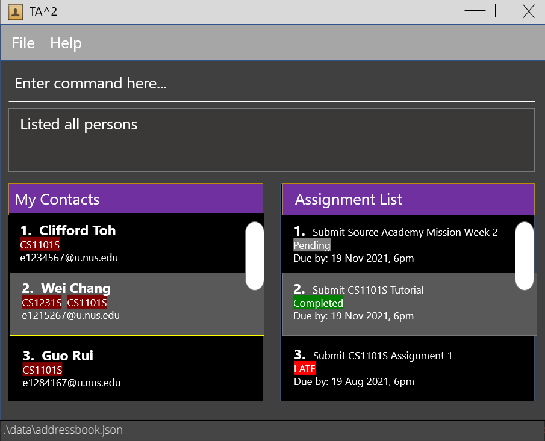

## What is TA2?

**Teaching Assistant's Assistant(TA2) is a desktop productivity application developed for teaching assistants to make their teaching journey smoother.**
With TA2, you can manage student information and keep track of the status of their assignments. Just type in
the corresponding commands and TA2 will manage all these for you! No need to do all these manually!

## How is TA2 different?

TA2 is optimised for use via a Command Line Interface(CLI) while still having the benefits of a Graphical User Interface(GUI).
This means that if you are able to type fast, TA2 will be able to manage student submissions much faster than other applications
that require you to use your mouse often. TA2 sorts all the information that you enter behind the scenes and
presents it to you in an organised manner when you ask for it. TA2 eliminates the problem of information overload
when trying to manage immense amounts of information. No more trying to filter out information on your own, TA2
will do it for you.

## For Users

* If you are interested in using TA2, head over to the [_Quick Start_ section of the **User Guide**](UserGuide.html#quick-start)
  to get your hands on this application.
* If you are unsure of how to use the application, the [**User Guide**](UserGuide.html) has a detailed walkthrough on its features.

## For Developers

* If you are interested in developing TA2, the [**Developer Guide**](DeveloperGuide.html) is a good place to start.

  
**Acknowledgements**

* **This application is based on the AddressBook-Level3 project created by the [SE-EDU initiative](https://se-education.org).**
    * For the detailed documentation of  AddressBook-Level3 project, see the **[Address Book Product Website](https://se-education.org/addressbook-level3)**.
* Libraries used: [JavaFX](https://openjfx.io/), [Jackson](https://github.com/FasterXML/jackson), [JUnit5](https://github.com/junit-team/junit5)
